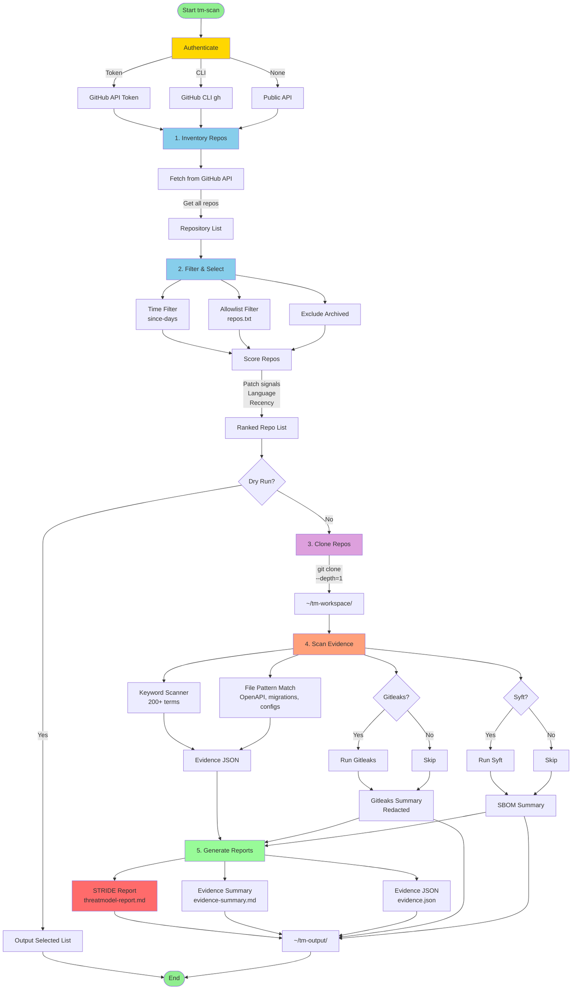

# tm-scan: Threat Modeling Scanner

A macOS-compatible, local-only threat modeling scanner for GitHub organizations. Generates per-repository Markdown reports for security review.

## Table of Contents

- [Quick Start](#quick-start-5-minutes)
- [Architecture & Workflow](#architecture--workflow)
- [Features](#features)
- [Detailed Setup](#detailed-setup)
- [Usage Examples](#usage-examples)
- [Output Structure](#output-structure)
- [Interpreting Reports](#interpreting-reports)
- [Extending Knowledge Base](#extending-knowledge-base)
- [Troubleshooting](#troubleshooting)

---

## Quick Start (5 Minutes)

### Step 1: Get a GitHub Token (2 minutes)

1. Go to: https://github.com/settings/tokens
2. Click **"Generate new token"** → **"Generate new token (classic)"**
3. Name it: `tm-scan`
4. Select scope: **`repo`** (required for private repositories)
5. Click **"Generate token"**
6. **Copy the token** (starts with `ghp_`)

> **Note**: This token is only stored locally and never uploaded.

### Step 2: Install the Tool (1 minute)

```bash
cd tm-scan
pip install -r requirements.txt
chmod +x tm-scan
```

### Step 3: Configure Authentication (1 minute)

**Choose ONE method:**

**Method A: .env file (Recommended - Easiest)**
```bash
cp .env.example .env
nano .env  # or use your preferred editor
# Add your token: GITHUB_TOKEN=ghp_your_token_here
# Save and exit
```

**Method B: Environment Variable**
```bash
export GITHUB_TOKEN=ghp_your_token_here
```

**Method C: GitHub CLI (Alternative)**
```bash
brew install gh
gh auth login
```

### Step 4: Run Your First Scan (1 minute)

```bash
# First, do a dry run to see what will be scanned
./tm-scan --org YOUR_ORG --since-days 30 --dry-run

# Then run the actual scan
./tm-scan --org YOUR_ORG --since-days 30 --max-repos 10
```

### Step 5: View Your Reports

```bash
# Reports are saved in ~/tm-output/reports/
ls ~/tm-output/reports/

# Open a threat model report
open ~/tm-output/repo-name/2025-02-13/threatmodel-report.md
```

---

## Architecture & Workflow

### High-Level Architecture

```
┌─────────────────────────────────────────────────────────────────────────────┐
│                           tm-scan Architecture                              │
├─────────────────────────────────────────────────────────────────────────────┤
│                                                                             │
│  ┌────────────┐     ┌────────────┐     ┌────────────┐     ┌───────────┐  │
│  │   GitHub   │────▶│ tm-scan    │────▶│ Local      │────▶│ Reports   │  │
│  │   Org/API  │     │   CLI      │     │ Scanner    │     │ (Markdown)│  │
│  └────────────┘     └────────────┘     └────────────┘     └───────────┘  │
│       ▲                   │                    │                              │
│       │                   │                    │                              │
│       │                   ▼                    ▼                              │
│  ┌────────────┐     ┌────────────┐     ┌────────────┐                      │
│  │   Token/   │     │ Knowledge  │     │ Optional   │                      │
│  │    CLI     │     │   Base     │     │  Tools     │                      │
│  │ (Auth)     │     │ (YAML KB)  │     │ gitleaks/  │                      │
│  └────────────┘     └────────────┘     │   syft     │                      │
│                                         └────────────┘                      │
│                                                                             │
└─────────────────────────────────────────────────────────────────────────────┘
```

### System Components

```
┌──────────────────────────────────────────────────────────────────────────────┐
│                              COMPONENTS                                     │
├──────────────────────────────────────────────────────────────────────────────┤
│                                                                              │
│  ┌─────────────────────────────────────────────────────────────────────┐    │
│  │                     CORE ENGINE (Python)                             │    │
│  │  ┌──────────┐ ┌──────────┐ ┌──────────┐ ┌──────────┐ ┌──────────┐  │    │
│  │  │ Config   │ │Inventory │ │Selector  │ │ Cloner   │ │ Scanner  │  │    │
│  │  │ Module   │ │  Module  │ │  Module  │ │  Module  │ │  Module  │  │    │
│  │  └──────────┘ └──────────┘ └──────────┘ └──────────┘ └──────────┘  │    │
│  │  ┌──────────┐ ┌──────────┐ ┌──────────┐                            │    │
│  │  │ Gitleaks │ │  Syft    │ │ Reporter │                            │    │
│  │  │ Wrapper  │ │ Wrapper  │ │  Module  │                            │    │
│  │  └──────────┘ └──────────┘ └──────────┘                            │    │
│  └─────────────────────────────────────────────────────────────────────┘    │
│                                                                              │
│  ┌─────────────────────────────────────────────────────────────────────┐    │
│  │                    KNOWLEDGE BASE (YAML)                             │    │
│  │  ┌──────────────────────┐  ┌──────────────────────┐                │    │
│  │  │   kb-keywords.yaml   │  │   kb-threats.yaml    │                │    │
│  │  │  - 200+ keywords     │  │  - STRIDE threats    │                │    │
│  │  │  - Categories        │  │  - Controls          │                │    │
│  │  │  - Priorities        │  │  - Questions         │                │    │
│  │  └──────────────────────┘  └──────────────────────┘                │    │
│  └─────────────────────────────────────────────────────────────────────┘    │
│                                                                              │
└──────────────────────────────────────────────────────────────────────────────┘
```

### Complete Workflow Diagram



### Data Flow Diagram

```
┌─────────────────────────────────────────────────────────────────────────────┐
│                              DATA FLOW                                      │
└─────────────────────────────────────────────────────────────────────────────┘

  INPUT                               PROCESS                              OUTPUT
┌─────────┐       ┌──────────────┐       ┌──────────────┐       ┌─────────┐
│         │       │              │       │              │       │         │
│ GitHub  │──────▶│   tm-scan    │──────▶│   Scanner    │──────▶│  JSON   │
│   API   │       │   CLI        │       │   Engine     │       │  Data   │
│         │       │              │       │              │       │         │
└─────────┘       └──────────────┘       └──────────────┘       └─────────┘
                       │                         │
                       │                         ▼
                       │                  ┌──────────────┐
  ┌─────────┐         │                  │              │
  │         │         │                  │ Knowledge    │
  │ .env    │─────────┘                  │    Base      │
  │ Token   │                            │   (YAML)     │
  │         │                            │              │
  └─────────┘                            └──────────────┘
                                                   │
                                                   ▼
                                          ┌──────────────┐
                                          │              │
                                          │   Reporter   │
                                          │   Module     │
                                          │              │
                                          └──────────────┘
                                                   │
                   ┌─────────────────────────────┼─────────────────────────────┐
                   ▼                             ▼                             ▼
            ┌─────────────┐              ┌─────────────┐              ┌─────────────┐
            │             │              │             │              │             │
            │  Evidence   │              │   STRIDE    │              │   Summary   │
            │  Summary    │              │   Report    │              │   Reports   │
            │  .md        │              │   .md       │              │   .txt      │
            │             │              │             │              │             │
            └─────────────┘              └─────────────┘              └─────────────┘
```

### Processing Pipeline

```
┌─────────────────────────────────────────────────────────────────────────────┐
│                        SCANNING PIPELINE STAGES                             │
├─────────────────────────────────────────────────────────────────────────────┤
│                                                                             │
│  STAGE 1: DISCOVERY                                   ┌─────────────────┐  │
│  ─────────────────                                   │   GitHub API    │  │
│  • List organization repos                           │                 │  │
│  • Get metadata (name, updated, language, etc.)      │  Token / CLI    │  │
│  • Apply time filter & allowlist                      │                 │  │
│                                                       └────────▲────────┘  │
│  STAGE 2: SELECTION                                            │           │
│  ──────────────                                            Auth           │
│  • Score by patch-specific signals                                            │
│  • Prioritize: Java/Oracle/risk/transaction keywords                         │
│  • Sort by score descending                                                   │
│  • Enforce max-repos limit                                                    │
│                                                                             │
│  STAGE 3: ACQUISITION                                   ┌─────────────────┐  │
│  ────────────────                                   │     Git SSH     │  │
│  • Clone repos (shallow, depth=1)                     │                 │  │
│  • Use shallow clone for speed                        │ git@github.com  │  │
│  • Workspace: ~/tm-workspace/                         │                 │  │
│                                                       └─────────────────┘  │
│  STAGE 4: ANALYSIS                                                             │
│  ─────────────                                                            │
│  ┌────────────────────────────────────────────────────────────────────┐   │
│  │                    EVIDENCE DISCOVERY                             │   │
│  ├────────────────────────────────────────────────────────────────────┤   │
│  │  • Keyword scanning (200+ patch-specific terms)                   │   │
│  │  • File pattern matching (OpenAPI, migrations, configs)           │   │
│  │  • Categorize by type (auth, database, business logic, etc.)     │   │
│  └────────────────────────────────────────────────────────────────────┘   │
│  ┌────────────────────────────────────────────────────────────────────┐   │
│  │                    OPTIONAL SCANNERS                              │   │
│  ├────────────────────────────────────────────────────────────────────┤   │
│  │  ┌─────────────────┐              ┌─────────────────┐             │   │
│  │  │   Gitleaks      │              │     Syft        │             │   │
│  │  │  (Secret Scan)  │              │   (SBOM Gen)    │             │   │
│  │  │  • Find tokens  │              │  • List pkgs    │             │   │
│  │  │  • Redact all   │              │  • Count types  │             │   │
│  │  │    values       │              │                 │             │   │
│  │  └─────────────────┘              └─────────────────┘             │   │
│  └────────────────────────────────────────────────────────────────────┘   │
│                                                                             │
│  STAGE 5: REPORTING                                                            │
│  ─────────────                                                              │
│  ┌────────────────────────────────────────────────────────────────────┐   │
│  │                  THREAT MODEL GENERATION                           │   │
│  ├────────────────────────────────────────────────────────────────────┤   │
│  │  • Map evidence to STRIDE categories                               │   │
│  │  • Match threats from knowledge base                               │   │
│  │  • Generate asset inventory table                                  │   │
│  │  • Create threat analysis table                                     │   │
│  │  • Prioritize recommendations                                       │   │
│  │  • Generate confirmation questions                                 │   │
│  └────────────────────────────────────────────────────────────────────┘   │
│                                                                             │
│  OUTPUT: ~/tm-output/reports/<repo>/YYYY-MM-DD/                             │
│           ├── threatmodel-report.md     (Main STRIDE report)               │
│           ├── evidence-summary.md        (Human-readable evidence)         │
│           ├── evidence.json              (Raw structured data)             │
│           ├── gitleaks-summary.json      (Secret scan counts)              │
│           └── sbom-summary.json          (Package inventory)               │
│                                                                             │
└─────────────────────────────────────────────────────────────────────────────┘
```

### Module Interaction Diagram

```
                    ┌─────────────────────────────────────┐
                    │         tm-scan CLI Entry           │
                    │          (main function)            │
                    └──────────────┬──────────────────────┘
                                   │
            ┌──────────────────────┼──────────────────────┐
            │                      │                      │
            ▼                      ▼                      ▼
    ┌───────────────┐    ┌───────────────┐    ┌───────────────┐
    │   Config      │    │  RepoInventory│    │  RepoSelector │
    │   Module      │    │    Module     │    │    Module     │
    │               │    │               │    │               │
    │ • Load .env   │    │ • Fetch repos │    │ • Score repos │
    │ • Parse args  │    │ • Apply filter│    │ • Prioritize  │
    │ • Setup dirs  │    │ • Save inv.   │    │ • Save list   │
    └───────────────┘    └───────┬───────┘    └───────┬───────┘
                                   │                     │
                                   └──────────┬──────────┘
                                              │
                                              ▼
                                    ┌───────────────┐
                                    │  RepoCloner   │
                                    │    Module     │
                                    │               │
                                    │ • git clone   │
                                    │ • shallow     │
                                    └───────┬───────┘
                                            │
                ┌───────────────────────────┼───────────────────────────┐
                │                           │                           │
                ▼                           ▼                           ▼
        ┌───────────────┐         ┌───────────────┐         ┌───────────────┐
        │EvidenceScanner│         │GitleaksWrapper│         │ SyftWrapper   │
        │    Module     │         │    Module     │         │    Module     │
        │               │         │               │         │               │
        │ • Keyword scan│         │ • Secret scan │         │ • SBOM gen    │
        │ • File match  │         │ • Redaction   │         │ • Pkg count   │
        └───────┬───────┘         └───────┬───────┘         └───────┬───────┘
                │                         │                         │
                └─────────────────────────┼─────────────────────────┘
                                          │
                                          ▼
                                ┌───────────────┐
                                │ ThreatModel   │
                                │   Reporter    │
                                │    Module     │
                                │               │
                                │ • STRIDE map  │
                                │ • Generate    │
                                │   reports     │
                                └───────┬───────┘
                                        │
                                        ▼
                                ┌───────────────┐
                                │  Output Files │
                                │               │
                                │ • .md reports │
                                │ • .json data  │
                                │ • .txt lists  │
                                └───────────────┘


    ┌─────────────────────────────────────────────────────────────────┐
    │                    KNOWLEDGE BASE SHARED                         │
    │  ┌──────────────────┐          ┌──────────────────┐            │
    │  │ kb-keywords.yaml │◀─────────│ kb-threats.yaml  │            │
    │  │                  │          │                  │            │
    │  │ • 200+ keywords  │          │ • STRIDE threats │            │
    │  │ • Categories     │          │ • Controls       │            │
    │  │ • Priorities     │          │ • Questions      │            │
    │  └──────────────────┘          └──────────────────┘            │
    └─────────────────────────────────────────────────────────────────┘
```

### Scan Decision Tree

```
                    START tm-scan
                         │
                         ▼
                ┌────────────────┐
                │ Auth Method?   │
                └────┬─────┬─────┘
                     │     │
              Token/CLI     │ None
                     │     │
                     ▼     ▼
              ┌──────────────────┐
              │ Private+Public   │      Public Only
              │ Repos            │      Repos
              └────────┬─────────┘
                       │
                       ▼
              ┌──────────────────┐
              │ since-days > 0?  │
              └────┬────────┬────┘
                   │        │
                  Yes       No
                   │        │
                   ▼        ▼
            ┌──────────┐  ┌──────────┐
            │ Filter   │  │ All      │
            │ by date  │  │ repos    │
            └────┬─────┘  └────┬─────┘
                 │             │
                 ▼             │
         ┌──────────────┐     │
         │repos.txt?    │     │
         └──┬───────┬───┘     │
            │       │         │
          Yes       No        │
            │       │         │
            ▼       ▼         ▼
    ┌──────────────────────────┐
    │    Apply allowlist       │
    │    AND time filter       │
    └──────────┬───────────────┘
               │
               ▼
    ┌──────────────────────┐
    │ Score & Prioritize   │
    │ • Patch signals: +10 │
    │ • Language: +5       │
    │ • Private: +3        │
    │ • Recent: +2         │
    └──────────┬───────────┘
               │
               ▼
    ┌──────────────────────┐
    │ max-repos limit?     │
    └──────────┬───────────┘
               │
               ▼
    ┌──────────────────────┐
    │   Clone & Scan       │
    │   (if not dry-run)   │
    └──────────┬───────────┘
               │
               ▼
    ┌──────────────────────┐
    │   Generate Reports   │
    └──────────┬───────────┘
               │
               ▼
              DONE
```

---

## Features

- **Local-first**: All scanning happens locally; no code uploads to cloud services
- **Flexible Authentication**: Works with GitHub Token (recommended) OR GitHub CLI
- **Hybrid Selection**: Filter repos by time (days since update), allowlist file, or both
- **Patch-Focused**: Prioritizes evidence related to:
  - PVF_DATE and date/time handling
  - Oracle/JDBC database connections
  - Risk scoring and transaction holds
  - Browser/OS detection and user-agent analysis
  - Case management and popup UI fields
  - Time intervals (10m, 30m, 1h, 4h, 24h, 7d)
- **STRIDE-Based Reports**: Generates structured threat model reports with evidence tables
- **Tool Integration**: Works with gitleaks (secret scanning) and syft (SBOM) when available
- **Knowledge-Based**: Uses YAML knowledge bases for extensible threat detection

---

## Detailed Setup

### Prerequisites

1. **macOS** with bash and Python 3.9+
2. **Git** with SSH access to GitHub (`git@github.com:org/...`)
3. **GitHub access** (choose one):
   - **GitHub Token** (recommended) - see Step 1 above
   - **GitHub CLI** - `brew install gh && gh auth login`
   - **No auth** - public repos only

### Optional Tools

These tools enhance scanning but are **not required**:

```bash
# Install gitleaks for secret scanning
brew install gitleaks

# Install syft for SBOM generation
brew install syft
```

> If not installed, tm-scan will warn and continue without these features.

---

## Usage Examples

### Example 1: Quick Scan of Recently Updated Repos

Scan repos updated in the last 7 days:

```bash
# Using .env file for auth
./tm-scan --org mbbgrp --since-days 7 --max-repos 20
```

### Example 2: Scan Specific Repos from Allowlist

**Step 1:** Create `repos.txt` with one repo per line:
```bash
cat > repos.txt << EOF
payment-service
user-management
risk-assessment
transaction-processor
case-management-ui
EOF
```

**Step 2:** Run scan:
```bash
./tm-scan --org mbbgrp --repos-file repos.txt --max-repos 10
```

### Example 3: Combined Time + Allowlist Filter

Only scan repos from `repos.txt` that were updated in the last 30 days:

```bash
./tm-scan --org mbbgrp --repos-file repos.txt --since-days 30
```

### Example 4: Dry Run (Preview Without Cloning)

See which repos would be selected without actually cloning them:

```bash
./tm-scan --org mbbgrp --since-days 30 --dry-run
```

Output example:
```
============================================================
Selected 15 repositories for scanning
============================================================
  1. risk-scoring-service         [Score:  45] Lang: Java            Updated: 2025-02-10
  2. transaction-processor        [Score:  40] Lang: Java            Updated: 2025-02-09
  3. case-management-ui           [Score:  35] Lang: TypeScript      Updated: 2025-02-08
...
============================================================
```

### Example 5: Deep Scan Mode

For more thorough analysis (full git history):

```bash
./tm-scan --org mbbgrp --since-days 30 --mode deep --depth 0 --max-repos 5
```

### Example 6: Scan Without Optional Tools

If gitleaks or syft are not installed, skip them:

```bash
./tm-scan --org mbbgrp --since-days 30 --no-gitleaks --no-sbom --max-repos 20
```

---

## Command-Line Options

| Option | Default | Description |
|--------|---------|-------------|
| `--org` | `mbbgrp` | GitHub organization name |
| `--github-token` | `$GITHUB_TOKEN` | GitHub Personal Access Token (or use `.env` file) |
| `--since-days` | `30` | Only scan repos updated within N days (0 = all time) |
| `--repos-file` | - | Path to allowlist file (one repo per line) |
| `--max-repos` | `50` | Maximum number of repos to scan |
| `--depth` | `1` | Git clone depth (1 = shallow, 0 = full history) |
| `--workspace-dir` | `~/tm-workspace` | Local clone location |
| `--output-dir` | `~/tm-output` | Report output location |
| `--mode` | `quick` | Scan mode: `quick` or `deep` |
| `--dry-run` | `false` | Print selected repos without cloning |
| `--no-gitleaks` | `false` | Skip gitleaks scanning |
| `--no-sbom` | `false` | Skip syft SBOM generation |

---

## Output Structure

```
~/tm-output/
├── run-metadata/
│   ├── run-config.json         # Configuration snapshot
│   ├── repo-inventory.json     # All repos discovered in org
│   ├── selected-repos.txt      # Repos selected for scan (with scores)
│   └── skipped-repos.txt       # Repos filtered out (archived, old, etc.)
├── reports/
│   └── <repo-name>/
│       └── <YYYY-MM-DD>/
│           ├── evidence.json           # Raw structured evidence (JSON)
│           ├── evidence-summary.md     # Human-readable evidence summary
│           ├── gitleaks-summary.json   # Secret scan counts (redacted)
│           ├── sbom-summary.json       # SBOM package summary
│           └── threatmodel-report.md   # ⭐ Main STRIDE threat model report
└── logs/
    └── run-20250213_143022.log  # Execution log with timestamps
```

---

## Interpreting Reports

### Main Report: `threatmodel-report.md`

This is the **primary report** for security review. It contains:

#### 1. Executive Summary
- Overall risk level (High/Medium/Low)
- Total findings counts
- Secret findings (from gitleaks)
- Total packages (from SBOM)

#### 2. Asset/Flow Inventory Table
| Asset/Flow | Confidentiality | Integrity | Availability | Sensitivity | Evidence | Notes |
|------------|-----------------|-----------|--------------|-------------|----------|-------|
| User Data (USERS table) | High | High | Medium | High | 5 references | Contains PII |
| Database (Oracle) | High | High | High | High | 12 references | Check connection security |

#### 3. Threat Analysis Table (STRIDE)
| Threat | STRIDE Category | Likelihood | Impact | Priority | Evidence | Recommended Controls |
|--------|-----------------|------------|--------|----------|----------|---------------------|
| PVF_DATE Manipulation | Tampering | High | High | TBD | 8 matches | Server-side validation |
| Risk Score Manipulation | Tampering | High | High | TBD | 15 matches | Calculate server-side |

#### 4. STRIDE Analysis
Detailed breakdown by category:
- **Spoofing**: User impersonation risks
- **Tampering**: Data manipulation risks
- **Repudiation**: Non-repudiation gaps
- **Information Disclosure**: Data exposure risks
- **Denial of Service**: Resource exhaustion
- **Elevation of Privilege**: Access control bypasses

#### 5. Recommendations
Prioritized by severity:
- **[CRITICAL]** Remove X potential secret(s)
- **[HIGH]** Review X high-priority code patterns
- **[MEDIUM]** Verify authentication implementation
- **[LOW]** Implement comprehensive audit logging

#### 6. Questions for Security Reviewers
Confirmation questions like:
1. Is PVF_DATE validated server-side?
2. Are risk scores calculated server-side only?
3. Are transaction holds enforced in the database?

### Evidence Summary: `evidence-summary.md`

Supplementary report showing:
- OpenAPI/Swagger specification files found
- Database migration files (Flyway, Liquibase)
- Configuration files (application.yml, .env, etc.)
- High-priority keyword hits with file locations
- Authentication/authorization hints
- Database technology hints (Oracle, MySQL, PostgreSQL, etc.)
- Risky configuration hints (redacted)

---

## Extending Knowledge Base

### Adding New Keywords

Edit `knowledge-base/kb-keywords.yaml`:

```yaml
patch_specific:
  - keyword: "YOUR_FEATURE"
    category: "business_logic"
    priority: "high"
    description: "Your feature description"

authentication:
  - keyword: "your_auth_method"
    category: "authn"
    priority: "medium"
    description: "Authentication method description"
```

### Adding New Threats

Edit `knowledge-base/kb-threats.yaml`:

```yaml
threats:
  - id: "TM-NEW-001"
    name: "Your Threat Name"
    stride_category: "Tampering"
    description: "Threat description"
    default_likelihood: "Medium"
    default_impact: "High"
    keywords: ["keyword1", "keyword2"]
    recommended_controls:
      - "Control 1"
      - "Control 2"
    questions_to_confirm:
      - "Question 1?"
      - "Question 2?"
```

---

## Redaction Policy

This tool **redacts all sensitive information**:

- ✅ **No code snippets** in reports
- ✅ **No secret values** in gitleaks output (counts only)
- ✅ **URLs truncated** or hashed
- ✅ **No tokens, passwords**, or connection strings

Example redaction:
```
Database URL: jdbc:oracle://<REDACTED>@host/...
```

---

## Troubleshooting

### "Permission denied (publickey)"

**Problem**: SSH key not configured for GitHub

**Solution**:
```bash
# Test SSH connection
ssh -T git@github.com

# If fails, add SSH key to GitHub:
# 1. Generate key: ssh-keygen -t ed25519
# 2. Copy key: cat ~/.ssh/id_ed25519.pub
# 3. Add to: https://github.com/settings/keys
```

### "Could not fetch repos"

**Problem**: GitHub authentication failed

**Solutions**:
1. Check token has `repo` scope
2. Verify organization name is correct
3. Check token hasn't expired:
```bash
curl -H "Authorization: token YOUR_TOKEN" https://api.github.com/user
```

### "Tool gitleaks not found"

**Solution**: This is a warning, not an error. The tool will continue.
- To install: `brew install gitleaks`
- Or skip: `./tm-scan --no-gitleaks ...`

### "Too many repos selected"

**Problem**: Scan would take too long

**Solutions**:
```bash
# Reduce number of repos
./tm-scan --org mbbgrp --since-days 7 --max-repos 10

# Use allowlist file
./tm-scan --org mbbgrp --repos-file repos.txt
```

### "Python module not found"

**Solution**:
```bash
pip install -r requirements.txt
```

Required packages:
- `pyyaml` - YAML parsing
- `requests` - HTTP requests

---

## Advanced Usage

### Custom Output Directory

```bash
./tm-scan --org mbbgrp --output-dir ~/my-reports --since-days 30
```

### Full History Deep Dive

```bash
./tm-scan --org mbbgrp --mode deep --depth 0 --max-repos 3
```

### Scan All Repos Regardless of Age

```bash
./tm-scan --org mbbgrp --since-days 0 --max-repos 100
```

### Cron Job for Regular Scans

```bash
# Add to crontab: crontab -e
# Run every Monday at 2 AM
0 2 * * 1 cd /path/to/tm-scan && ./tm-scan --org mbbgrp --since-days 7 --max-repos 50
```

---

## License

Internal use tool for mbbgrp organization.

---

## Getting Help

1. Check this README first
2. Review `QUICKSTART.md` for 5-minute setup
3. Check logs: `~/tm-output/logs/run-*.log`
4. Run with `--dry-run` to preview selection
5. Use `--help` for command-line options

```bash
./tm-scan --help
```
