# tm-scan — Enterprise Agentic Threat Modeling Engine

<div align="center">


**A zero-PAT, five-dimensional threat modeling scanner that runs locally or in CI/CD**

Generates Markdown, SARIF, and Mermaid DFDs with deterministic PR feedback — no external LLMs required.

</div>

---

## Table of Contents

- [Overview](#overview)
- [Why tm-scan](#why-tm-scan)
- [Architecture](#architecture)
- [Five-Dimensional Framework](#five-dimensional-framework)
- [Quickstart](#quickstart)
- [CI/CD Integration](#cicd-integration)
- [PR Reviewer Bot](#pr-reviewer-bot)
- [Configuration](#configuration)
- [Outputs](#outputs)
- [Knowledge Base](#knowledge-base)
- [Development](#development)

---

## Overview

**tm-scan** is an automated threat modeling scanner that combines multiple security frameworks into a single, deterministic engine. It scans code repositories for security-relevant evidence, maps findings to threat models, and generates actionable reports with inline PR feedback.

### Key Features

| Feature | Description |
|---------|-------------|
| **Zero-PAT Auth** | Uses GitHub Actions token in CI or `gh` CLI locally — no manual PAT management |
| **5-D Framework** | STRIDE + PASTA + LINDDUN + CWE + DREAD in one pass |
| **Deterministic** | Rule-based matching produces consistent, reproducible results |
| **Multi-Format Output** | Markdown reports, SARIF for code scanning, Evidence JSON, optional PDF |
| **PR Guardrails** | Automatic inline comments with reviewer guidance and fix snippets |
| **Quality Gates** | DREAD-based threshold enforcement (avg ≥ 8.0 fails CI) |
| **Enterprise Ready** | Supports GitHub Enterprise Server, custom API endpoints |

---

## Why tm-scan

### For Security Teams
- **Scale:** Scan entire organizations with time-based and allowlist filtering
- **Consistency:** Deterministic rules ensure repeatable results
- **Integration:** Native SARIF output for GitHub Security tab
- **Evidence-Based:** All findings backed by code location and threat model references

### For Development Teams
- **Fast Feedback:** CI/CD integration with inline PR comments
- **Actionable:** Specific fix snippets, not generic warnings
- **Zero Config:** Works out of the box with sensible defaults
- **Local Testing:** Run on your machine before pushing

### For Compliance
- **Audit Trail:** JSON evidence files for every scan
- **CWE Mapping:** Direct mapping to MITRE CWE standard
- **DREAD Scoring:** Quantified risk assessment
- **Privacy-Aware:** LINDDUN categories for data protection

---

## Architecture

### High-Level Flow

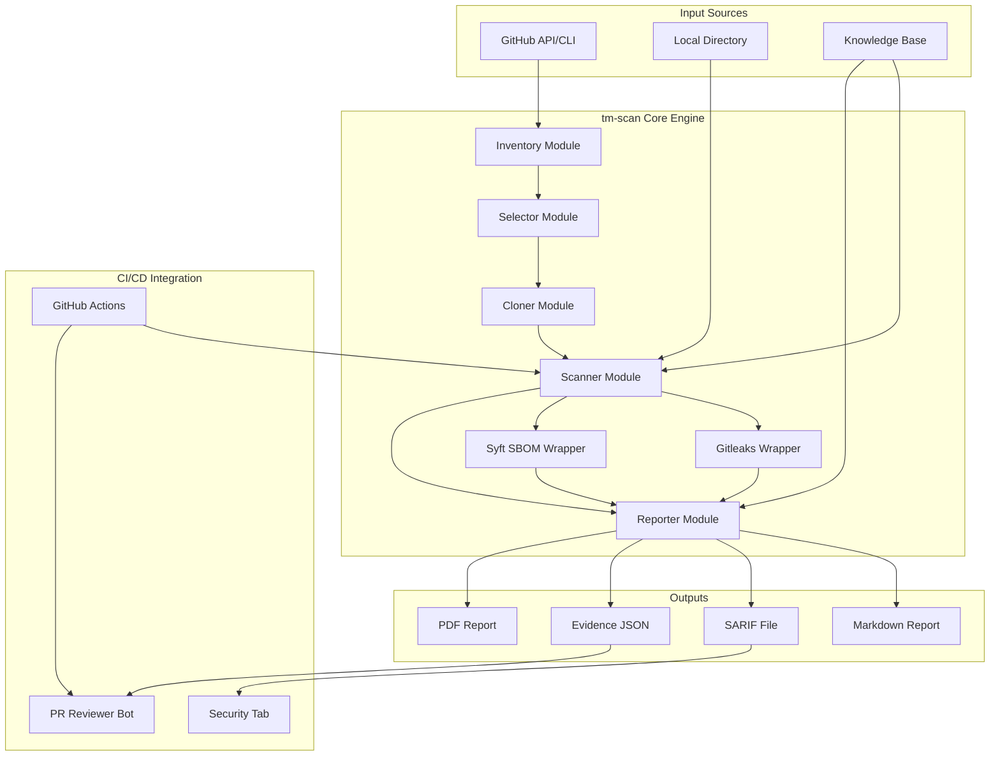
```mermaid
flowchart TD
    subgraph Input["Input Sources"]
        GH[GitHub API/CLI]
        Local[Local Directory]
        KB[Knowledge Base]
    end

    subgraph Core["tm-scan Core Engine"]
        Inv[Inventory Module]
        Sel[Selector Module]
        Cln[Cloner Module]
        Scn[Scanner Module]
        GT[Gitleaks Wrapper]
        ST[Syft SBOM Wrapper]
        Rep[Reporter Module]
    end

    subgraph Output["Outputs"]
        MD[Markdown Report]
        SARIF[SARIF File]
        EJSON[Evidence JSON]
        PDF[PDF Report]
    end

    subgraph CI["CI/CD Integration"]
        Workflow[GitHub Actions]
        PRBot[PR Reviewer Bot]
        SecurityTab[Security Tab]
    end

    GH --> Inv
    Local --> Scn
    KB --> Scn
    KB --> Rep

    Inv --> Sel
    Sel --> Cln
    Cln --> Scn
    Scn --> GT
    Scn --> ST
    Scn --> Rep
    GT --> Rep
    ST --> Rep

    Rep --> MD
    Rep --> SARIF
    Rep --> EJSON
    Rep --> PDF

    SARIF --> SecurityTab
    Workflow --> Scn
    Workflow --> PRBot
    EJSON --> PRBot
```

### Module Architecture

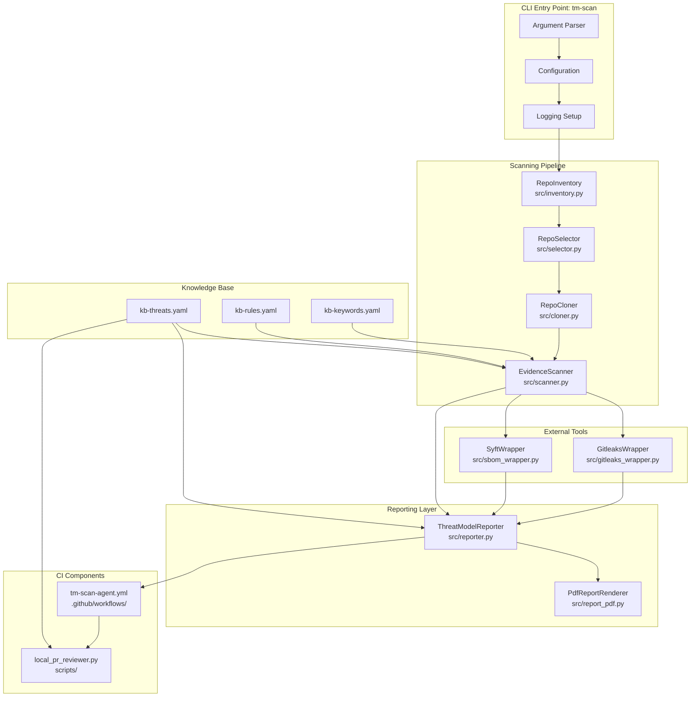
```mermaid
graph TB
    subgraph CLI["CLI Entry Point: tm-scan"]
        Parser[Argument Parser]
        Config[Configuration]
        Logger[Logging Setup]
    end

    subgraph Pipeline["Scanning Pipeline"]
        Inv[RepoInventory<br/>src/inventory.py]
        Sel[RepoSelector<br/>src/selector.py]
        Cln[RepoCloner<br/>src/cloner.py]
        Scn[EvidenceScanner<br/>src/scanner.py]
    end

    subgraph Tools["External Tools"]
        GL[GitleaksWrapper<br/>src/gitleaks_wrapper.py]
        SY[SyftWrapper<br/>src/sbom_wrapper.py]
    end

    subgraph Reporting["Reporting Layer"]
        TMR[ThreatModelReporter<br/>src/reporter.py]
        PDF[PdfReportRenderer<br/>src/report_pdf.py]
    end

    subgraph CI["CI Components"]
        WF[tm-scan-agent.yml<br/>.github/workflows/]
        PRB[local_pr_reviewer.py<br/>scripts/]
    end

    subgraph Knowledge["Knowledge Base"]
        KB_T[kb-threats.yaml]
        KB_R[kb-rules.yaml]
        KB_K[kb-keywords.yaml]
    end

    Parser --> Config
    Config --> Logger

    Logger --> Inv
    Inv --> Sel
    Sel --> Cln
    Cln --> Scn

    Scn --> GL
    Scn --> SY

    Scn --> TMR
    GL --> TMR
    SY --> TMR
    TMR --> PDF

    KB_T --> Scn
    KB_R --> Scn
    KB_K --> Scn
    KB_T --> TMR
    KB_T --> PRB

    TMR --> WF
    WF --> PRB
```

### End-to-End Scanning Workflow

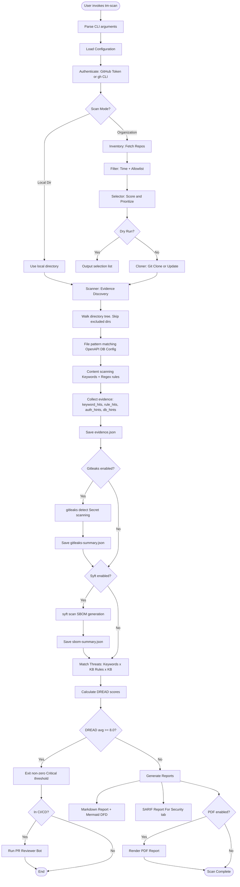
```mermaid
flowchart TD
    Start([User invokes tm-scan]) --> Parse[Parse CLI arguments]
    Parse --> Config[Load Configuration]
    Config --> Auth[Authenticate: GitHub Token or gh CLI]

    Auth --> Mode{Scan Mode?}

    Mode -->|Local Dir| Local[Use local directory]
    Mode -->|Organization| Inv[Inventory: Fetch Repos]

    Inv --> Filter[Filter: Time + Allowlist]
    Filter --> Select[Selector: Score and Prioritize]
    Select --> DryRun{Dry Run?}
    DryRun -->|Yes| OutputDry[Output selection list]
    DryRun -->|No| Clone[Cloner: Git Clone or Update]

    Local --> Scan
    Clone --> Scan[Scanner: Evidence Discovery]

    Scan --> FileScan[Walk directory tree. Skip excluded dirs]
    FileScan --> Pattern[File pattern matching OpenAPI DB Config]
    Pattern --> Content[Content scanning Keywords + Regex rules]

    Content --> Evidence[Collect evidence: keyword_hits, rule_hits, auth_hints, db_hints]
    Evidence --> SaveEvid[Save evidence.json]

    SaveEvid --> Gitleaks{Gitleaks enabled?}
    Gitleaks -->|Yes| SecretScan[gitleaks detect Secret scanning]
    Gitleaks -->|No| SyftCheck
    SecretScan --> SaveGL[Save gitleaks-summary.json]

    SaveGL --> SyftCheck{Syft enabled?}
    SyftCheck -->|Yes| SBOM[syft scan SBOM generation]
    SyftCheck -->|No| Match
    SBOM --> SaveSyft[Save sbom-summary.json]

    SaveSyft --> Match[Match Threats: Keywords x KB Rules x KB]
    Match --> DREAD[Calculate DREAD scores]

    DREAD --> QualityGate{DREAD avg >= 8.0?}
    QualityGate -->|Yes| Fail[Exit non-zero Critical threshold]
    QualityGate -->|No| Generate[Generate Reports]

    Generate --> MD[Markdown Report + Mermaid DFD]
    Generate --> SARIF[SARIF Report For Security tab]
    Generate --> PDF{PDF enabled?}

    PDF -->|Yes| RenderPDF[Render PDF Report]
    PDF -->|No| Complete
    RenderPDF --> Complete([Scan Complete])

    Fail --> PRBot{In CI/CD?}
    PRBot -->|Yes| RunPRBot[Run PR Reviewer Bot]
    PRBot -->|No| End
    RunPRBot --> End([End])
```

### Evidence Discovery Flow

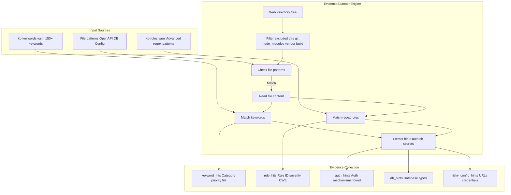
```mermaid
flowchart TD
    subgraph Input["Input Sources"]
        KB_Keywords[kb-keywords.yaml 150+ keywords]
        KB_Rules[kb-rules.yaml Advanced regex patterns]
        FilePatterns[File patterns OpenAPI DB Config]
    end

    subgraph Scanner["EvidenceScanner Engine"]
        Walk[Walk directory tree]
        Filter[Filter excluded dirs git node_modules vendor build]
        Check[Check file patterns]
        Read[Read file content]
        MatchKW[Match keywords]
        MatchRules[Match regex rules]
        ExtractHints[Extract hints auth db secrets]
    end

    subgraph Output["Evidence Collection"]
        KeywordHits[keyword_hits Category priority file]
        RuleHits[rule_hits Rule ID severity CWE]
        AuthHints[auth_hints Auth mechanisms found]
        DBHints[db_hints Database types]
        RiskyConfigs[risky_config_hints URLs credentials]
    end

    KB_Keywords --> MatchKW
    KB_Rules --> MatchRules
    FilePatterns --> Check

    Walk --> Filter
    Filter --> Check
    Check -->|Match| Read
    Read --> MatchKW
    Read --> MatchRules

    MatchKW --> ExtractHints
    MatchRules --> ExtractHints

    MatchKW --> KeywordHits
    MatchRules --> RuleHits
    ExtractHints --> AuthHints
    ExtractHints --> DBHints
    ExtractHints --> RiskyConfigs
```

### Threat Matching Process

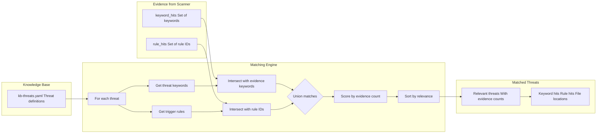
```mermaid
flowchart LR
    subgraph Evidence["Evidence from Scanner"]
        EK[keyword_hits Set of keywords]
        ER[rule_hits Set of rule IDs]
    end

    subgraph Knowledge["Knowledge Base"]
        KT[kb-threats.yaml Threat definitions]
    end

    subgraph Process["Matching Engine"]
        Iter1[For each threat]
        GetKeys[Get threat keywords]
        GetRules[Get trigger rules]
        IntersectK[Intersect with evidence keywords]
        IntersectR[Intersect with rule IDs]
        Union{Union matches}
        Score[Score by evidence count]
        Sort[Sort by relevance]
    end

    subgraph Output["Matched Threats"]
        MT[Relevant threats With evidence counts]
        Details[Keyword hits Rule hits File locations]
    end

    EK --> IntersectK
    ER --> IntersectR
    KT --> Iter1

    Iter1 --> GetKeys
    Iter1 --> GetRules
    GetKeys --> IntersectK
    GetRules --> IntersectR

    IntersectK --> Union
    IntersectR --> Union
    Union --> Score
    Score --> Sort
    Sort --> MT
    MT --> Details
```

### Report Generation Flow

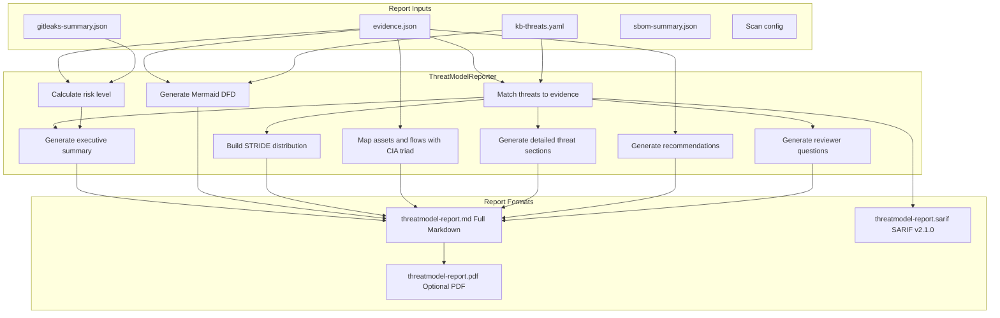
```mermaid
flowchart TD
    subgraph Inputs["Report Inputs"]
        Evidence[evidence.json]
        KB[kb-threats.yaml]
        Gitleaks[gitleaks-summary.json]
        SBOM[sbom-summary.json]
        Config[Scan config]
    end

    subgraph Report["ThreatModelReporter"]
        Match[Match threats to evidence]
        Exec[Generate executive summary]
        Risk[Calculate risk level]
        DFD[Generate Mermaid DFD]
        STRIDE[Build STRIDE distribution]
        Assets[Map assets and flows with CIA triad]
        Details[Generate detailed threat sections]
        Recs[Generate recommendations]
        Quest[Generate reviewer questions]
    end

    subgraph Outputs["Report Formats"]
        MD[threatmodel-report.md Full Markdown]
        SARIF[threatmodel-report.sarif SARIF v2.1.0]
        PDF[threatmodel-report.pdf Optional PDF]
    end

    Evidence --> Match
    KB --> Match
    Match --> Exec
    Evidence --> Risk
    Gitleaks --> Risk
    Risk --> Exec

    Evidence --> DFD
    KB --> DFD

    Match --> STRIDE
    Evidence --> Assets
    Match --> Details
    Evidence --> Recs
    Match --> Quest

    Exec --> MD
    DFD --> MD
    STRIDE --> MD
    Assets --> MD
    Details --> MD
    Recs --> MD
    Quest --> MD

    Match --> SARIF

    MD --> PDF
```

### Quality Gate Flow

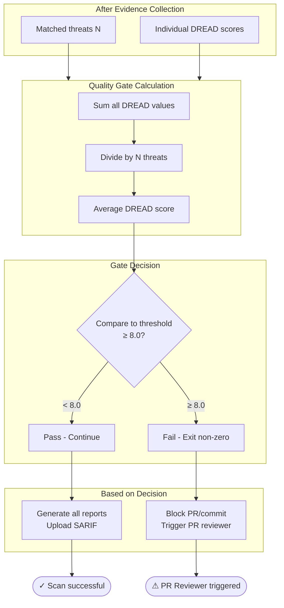
```mermaid
flowchart TD
    subgraph Scan["After Evidence Collection"]
        Threats[Matched threats N]
        DREAD_Values[Individual DREAD scores]
    end

    subgraph Calculate["Quality Gate Calculation"]
        Sum[Sum all DREAD values]
        Divide[Divide by N threats]
        Avg[Average DREAD score]
    end

    subgraph Decision["Gate Decision"]
        Compare{Compare to threshold<br/>≥ 8.0?}
        Pass[Pass - Continue]
        Fail[Fail - Exit non-zero]
    end

    subgraph Actions["Based on Decision"]
        Generate[Generate all reports<br/>Upload SARIF]
        Block[Block PR/commit<br/>Trigger PR reviewer]
    end

    Threats --> Calculate
    DREAD_Values --> Calculate

    Sum --> Divide
    Divide --> Avg
    Avg --> Compare

    Compare -->|< 8.0| Pass
    Compare -->|≥ 8.0| Fail

    Pass --> Generate
    Fail --> Block

    Generate --> Success([✓ Scan successful])
    Block --> PRReviewer([⚠ PR Reviewer triggered])
```

### Data Flow Diagram

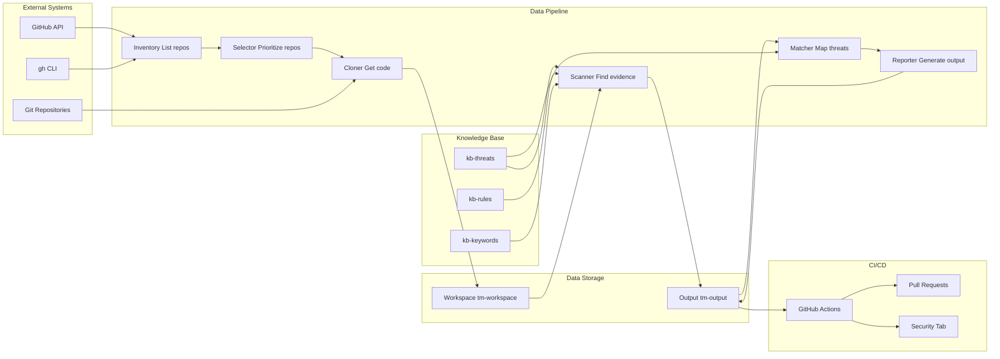
```mermaid
flowchart LR
    subgraph External["External Systems"]
        GH_API[GitHub API]
        GH_CLI[gh CLI]
        GIT[Git Repositories]
    end

    subgraph Knowledge["Knowledge Base"]
        KB1[kb-threats]
        KB2[kb-rules]
        KB3[kb-keywords]
    end

    subgraph Pipeline["Data Pipeline"]
        Inv[Inventory List repos]
        Sel[Selector Prioritize repos]
        Cln[Cloner Get code]
        Scn[Scanner Find evidence]
        Mat[Matcher Map threats]
        Rep[Reporter Generate output]
    end

    subgraph Storage["Data Storage"]
        WS[Workspace tm-workspace]
        OUT[Output tm-output]
    end

    subgraph CI["CI/CD"]
        GHA[GitHub Actions]
        PR[Pull Requests]
        SEC[Security Tab]
    end

    GH_API --> Inv
    GH_CLI --> Inv
    Inv --> Sel
    Sel --> Cln
    GIT --> Cln

    Cln --> WS
    WS --> Scn

    KB1 --> Scn
    KB2 --> Scn
    KB3 --> Scn

    Scn --> OUT
    OUT --> Mat

    KB1 --> Mat
    Mat --> Rep

    Rep --> OUT

    OUT --> GHA
    GHA --> PR
    GHA --> SEC
```

### State Transition Diagram

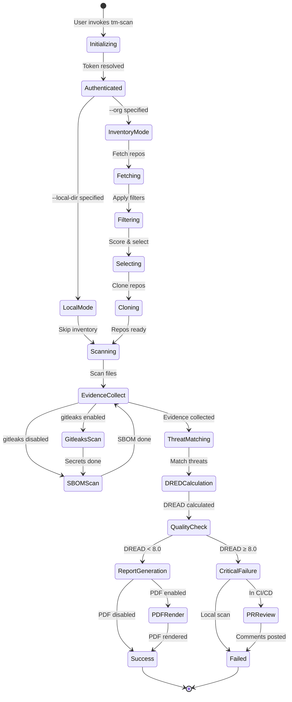
```mermaid
stateDiagram-v2
    [*] --> Initializing: User invokes tm-scan

    Initializing --> Authenticated: Token resolved
    Authenticated --> InventoryMode: --org specified
    Authenticated --> LocalMode: --local-dir specified

    InventoryMode --> Fetching: Fetch repos
    Fetching --> Filtering: Apply filters
    Filtering --> Selecting: Score & select
    Selecting --> Cloning: Clone repos

    LocalMode --> Scanning: Skip inventory

    Cloning --> Scanning: Repos ready
    Scanning --> EvidenceCollect: Scan files

    EvidenceCollect --> GitleaksScan: gitleaks enabled
    EvidenceCollect --> SBOMScan: gitleaks disabled
    GitleaksScan --> SBOMScan: Secrets done
    SBOMScan --> EvidenceCollect: SBOM done

    EvidenceCollect --> ThreatMatching: Evidence collected
    ThreatMatching --> DREDCalculation: Match threats

    DREDCalculation --> QualityCheck: DREAD calculated
    QualityCheck --> ReportGeneration: DREAD < 8.0
    QualityCheck --> CriticalFailure: DREAD ≥ 8.0

    ReportGeneration --> PDFRender: PDF enabled
    ReportGeneration --> Success: PDF disabled
    PDFRender --> Success: PDF rendered

    CriticalFailure --> PRReview: In CI/CD
    CriticalFailure --> Failed: Local scan
    PRReview --> Failed: Comments posted

    Success --> [*]
    Failed --> [*]
```

### CI/CD Workflow

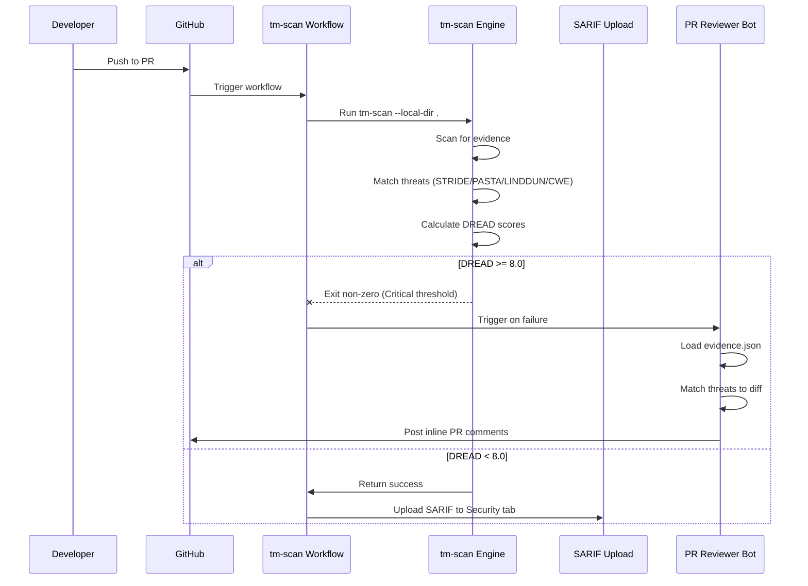
```mermaid
sequenceDiagram
    participant Dev as Developer
    participant GH as GitHub
    participant WFA as tm-scan Workflow
    participant Scanner as tm-scan Engine
    participant SARIF as SARIF Upload
    participant PRBot as PR Reviewer Bot

    Dev->>GH: Push to PR
    GH->>WFA: Trigger workflow
    WFA->>Scanner: Run tm-scan --local-dir .

    Scanner->>Scanner: Scan for evidence
    Scanner->>Scanner: Match threats (STRIDE/PASTA/LINDDUN/CWE)
    Scanner->>Scanner: Calculate DREAD scores

    alt DREAD >= 8.0
        Scanner--xWFA: Exit non-zero (Critical threshold)
        WFA->>PRBot: Trigger on failure
        PRBot->>PRBot: Load evidence.json
        PRBot->>PRBot: Match threats to diff
        PRBot->>GH: Post inline PR comments
    else DREAD < 8.0
        Scanner->>WFA: Return success
        WFA->>SARIF: Upload SARIF to Security tab
    end
```

### Detailed Step-by-Step Workflow


```mermaid
flowchart TD
    subgraph P1["Phase 1: Initialization"]
        P1A[1. Parse CLI arguments]
        P1B[2. Load configuration]
        P1C[3. Resolve authentication]
        P1D[4. Setup logging]
    end

    subgraph P2["Phase 2: Repository Discovery"]
        P2A[5. Fetch repository list via GitHub API or gh CLI]
        P2B[6. Apply filters: Time, Allowlist, Exclude archived]
        P2C[7. Score and prioritize repos based on signals]
        P2D[8. Select top N repos]
    end

    subgraph P3["Phase 3: Code Acquisition"]
        P3A[9. Clone or update repos. Shallow clone depth 1]
        P3B[10. Verify repo integrity]
    end

    subgraph P4["Phase 4: Evidence Discovery"]
        P4A[11. Walk directory tree. Skip excluded dirs]
        P4B[12. File pattern matching for OpenAPI, DB, Config]
        P4C[13. Content scanning: Keywords and Regex rules]
        P4D[14. Categorize findings: auth, db, risky configs]
    end

    subgraph P5["Phase 5: Enhanced Scanning"]
        P5A[15. Gitleaks secret scan. Find passwords and tokens]
        P5B[16. Syft SBOM generation. Inventory packages]
    end

    subgraph P6["Phase 6: Threat Mapping"]
        P6A[17. Load threat knowledge base]
        P6B[18. Match evidence to threats using KB]
        P6C[19. Calculate DREAD scores per threat]
        P6D[20. Aggregate stats: STRIDE, Risk summary]
    end

    subgraph P7["Phase 7: Quality Gate"]
        P7A[21. Calculate average DREAD]
        P7B[22. Check threshold 8.0]
        P7C[23. Pass or fail scan]
    end

    subgraph P8["Phase 8: Report Generation"]
        P8A[24. Generate Markdown report with all sections]
        P8B[25. Generate SARIF report CWE-mapped]
        P8C[26. Save evidence JSON raw findings]
        P8D[27. Optional PDF render]
    end

    subgraph P9["Phase 9: CI/CD Actions"]
        P9A[28. Upload SARIF to GitHub Security tab]
        P9B{29. Scan failed?}
        P9C[30. Trigger PR reviewer with inline comments]
    end

    P1 --> P2
    P2 -->|Local skip| P4
    P2 -->|Org mode| P3
    P3 --> P4
    P4 --> P5
    P5 --> P6
    P6 --> P7
    P7 --> P8
    P8 --> P9
    P9 -->|Yes| P9C
    P9 -->|No| Done([Scan Complete])
```

### Workflow Timing Diagram


```mermaid
gantt
    title tm-scan Execution Timeline
    dateFormat s
    axisFormat %Ss

    section Initialization
    Parse & Config        :a1, 0, 1s
    Auth Setup           :a2, after a1, 1s

    section Repository Discovery
    Fetch Repos          :b1, after a2, 3s
    Filter & Select      :b2, after b1, 1s

    section Code Acquisition
    Clone Repos          :c1, after b2, 10s

    section Evidence Discovery
    Scan Files           :d1, after c1, 15s
    Match Patterns       :d2, after d1, 5s

    section Enhanced Scanning
    Gitleaks Scan        :e1, after d2, 10s
    Syft SBOM            :e2, after d2, 5s

    section Threat Mapping
    Match Threats        :f1, after e1, 3s
    Calculate DREAD      :f2, after f1, 2s

    section Reporting
    Generate Reports     :g1, after f2, 3s
    Upload SARIF         :g2, after g1, 2s
```

---

## Five-Dimensional Framework

tm-scan fuses five complementary security frameworks into a unified threat model:

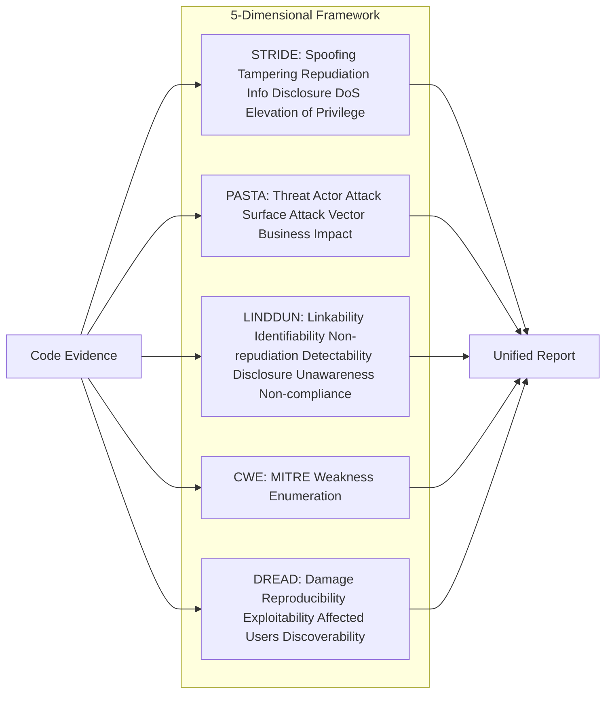
```mermaid
graph LR
    subgraph Dimensions["5-Dimensional Framework"]
        STRIDE[STRIDE: Spoofing Tampering Repudiation Info Disclosure DoS Elevation of Privilege]
        PASTA[PASTA: Threat Actor Attack Surface Attack Vector Business Impact]
        LINDDUN[LINDDUN: Linkability Identifiability Non-repudiation Detectability Disclosure Unawareness Non-compliance]
        CWE[CWE: MITRE Weakness Enumeration]
        DREAD[DREAD: Damage Reproducibility Exploitability Affected Users Discoverability]
    end

    Evidence[Code Evidence] --> STRIDE
    Evidence --> PASTA
    Evidence --> LINDDUN
    Evidence --> CWE
    Evidence --> DREAD

    STRIDE --> Report[Unified Report]
    PASTA --> Report
    LINDDUN --> Report
    CWE --> Report
    DREAD --> Report
```

### 1. STRIDE Categories

| Category | Description | Example Indicators |
|----------|-------------|-------------------|
| **Spoofing** | Impersonation of users or systems | `auth`, `login`, `jwt`, `session` |
| **Tampering** | Unauthorized data modification | `update`, `delete`, `sql`, `transaction` |
| **Repudiation** | Denial of actions | Missing audit logs, non-atomic operations |
| **Information Disclosure** | Data exposure | `secret`, `password`, `api_key`, `token` |
| **Denial of Service** | Availability impact | Unbounded loops, missing rate limits |
| **Elevation of Privilege** | Unauthorized privilege gain | `admin`, `escalate`, `sudo`, `role` |

### 2. PASTA Context

| Element | Description | Example |
|---------|-------------|---------|
| **Threat Actor** | Who is attacking? | External authenticated user, insider, automated scanner |
| **Attack Surface** | Where is the entry point? | REST API, GraphQL endpoint, webhook handler |
| **Attack Vector** | How is the attack delivered? | Manipulated IDs, user-controlled URLs, input payload |
| **Business Impact** | What is the damage? | Data breach, financial loss, compliance violation |

### 3. LINDDUN Privacy

| Category | Privacy Concern | Detection |
|----------|-----------------|-----------|
| **Linkability** | Data can be linked across contexts | Shared identifiers, cross-tenant data access |
| **Identifiability** | Data can identify individuals | PII in logs, user tables without protection |
| **Non-repudiation** | Actions cannot be denied | Missing audit trails, unsigned operations |
| **Detectability** | Data disclosure can be detected | Error messages revealing internal state |
| **Disclosure of Information** | Unintended data exposure | Debug info, verbose errors |
| **Unawareness** | Subjects unaware of data use | Hidden data collection, opaque processing |
| **Non-compliance** | Regulatory violations | Missing consent, inadequate data protection |

### 4. CWE Mapping

Each threat maps to MITRE CWE identifiers for standards compliance:
- `CWE-89`: SQL Injection
- `CWE-639`: IDOR (Broken Object Level Authorization)
- `CWE-918`: Server-Side Request Forgery
- `CWE-798`: Hardcoded Credentials
- And 50+ more...

### 5. DREAD Scoring

| Factor | Scale | Weight |
|--------|-------|--------|
| **Damage** | 1-10 | How bad is the impact? |
| **Reproducibility** | 1-10 | How easy is it to reproduce? |
| **Exploitability** | 1-10 | How much work is required? |
| **Affected Users** | 1-10 | How many users are impacted? |
| **Discoverability** | 1-10 | How easy is it to find? |

**Quality Gate:** Average DREAD ≥ 8.0 fails CI and marks SARIF as `error`.

---

## Quickstart

### Prerequisites

```bash
# Python 3.9+
python --version

# GitHub CLI (for local scanning)
gh --version

# Optional: gitleaks and syft for enhanced scanning
gitleaks --version
syft --version
```

### Installation

```bash
# Clone repository
git clone https://github.com/your-org/tm-scan.git
cd tm-scan

# Install dependencies
python -m pip install -r requirements.txt

# Make executable
chmod +x tm-scan
```

### Local Scan

```bash
# Scan local directory (recommended for single repo)
./tm-scan --local-dir . --mode quick --fail-on-critical

# Scan organization repos
gh auth login
./tm-scan --org my-org --since-days 30 --max-repos 10

# Dry run (show selected repos without scanning)
./tm-scan --org my-org --since-days 30 --dry-run
```

### Output Location

All artifacts are stored under `~/tm-output/`:

```
~/tm-output/
├── reports/
│   └── <repo-name>/
│       └── 2025-01-15/
│           ├── threatmodel-report.md      # Full report with Mermaid DFD
│           ├── threatmodel-report.sarif   # GitHub Security import
│           ├── evidence.json              # Raw findings
│           ├── evidence-summary.md        # Evidence overview
│           ├── gitleaks-summary.json      # Secret scan results
│           └── sbom-summary.json          # Dependency inventory
├── run-metadata/
│   ├── run-config.json                   # Scan configuration
│   ├── repo-inventory.json               # All discovered repos
│   ├── selected-repos.txt                # Prioritized selection
│   └── skipped-repos.txt                 # Unselected repos
└── logs/
    └── run-20250115_143022.log           # Detailed execution log
```

---

## CI/CD Integration

### Workflow File

Create `.github/workflows/tm-scan-agent.yml`:

```yaml
name: tm-scan agentic workflow

on:
  pull_request:
    branches: ["**"]

permissions:
  contents: read
  pull-requests: write
  security-events: write

jobs:
  tm-scan:
    runs-on: ubuntu-latest
    steps:
      - name: Checkout
        uses: actions/checkout@v4

      - name: Set up Python
        uses: actions/setup-python@v5
        with:
          python-version: "3.11"

      - name: Install dependencies
        run: |
          python -m pip install --upgrade pip
          pip install -r requirements.txt

      - name: Run tm-scan (local quick mode)
        env:
          GITHUB_TOKEN: ${{ secrets.GITHUB_TOKEN }}
          GITHUB_ACTIONS: "true"
        run: |
          chmod +x tm-scan
          ./tm-scan --local-dir . --mode quick --fail-on-critical

      - name: Locate SARIF artifact
        if: success() || failure()
        run: |
          SARIF_PATH=$(find "$HOME/tm-output" -name "threatmodel-report.sarif" -print -quit)
          if [ -z "$SARIF_PATH" ]; then
            echo "No SARIF file found." && exit 0
          fi
          echo "SARIF_FILE=$SARIF_PATH" >> "$GITHUB_ENV"

      - name: Upload SARIF results
        if: success() || failure()
        uses: github/codeql-action/upload-sarif@v3
        with:
          sarif_file: ${{ env.SARIF_FILE }}

      - name: Run deterministic PR reviewer
        if: failure()
        env:
          GITHUB_TOKEN: ${{ secrets.GITHUB_TOKEN }}
          GITHUB_REPOSITORY: ${{ github.repository }}
          GITHUB_EVENT_PATH: ${{ github.event_path }}
        run: |
          python scripts/local_pr_reviewer.py
```

### What Happens in CI?

1. **Checkout** — Gets your PR code
2. **Scan** — Runs `tm-scan` in local mode
3. **Quality Gate** — Checks DREAD average
4. **SARIF Upload** — Sends results to Security tab
5. **PR Review** — On failure, posts inline comments

---

## PR Reviewer Bot

The deterministic PR reviewer provides inline feedback without external LLMs:

### How It Works

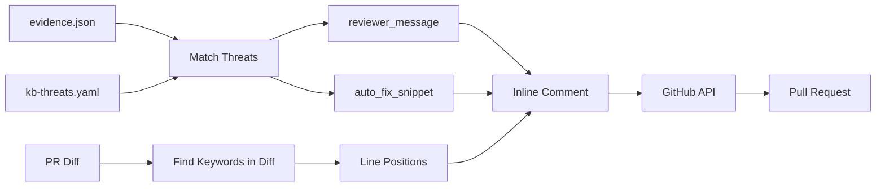
```mermaid
flowchart LR
    Evidence[evidence.json] --> Match[Match Threats]
    KB[kb-threats.yaml] --> Match

    Match --> ReviewMsg[reviewer_message]
    Match --> FixSnippet[auto_fix_snippet]

    PRDiff[PR Diff] --> Locate[Find Keywords in Diff]
    Locate --> Positions[Line Positions]

    ReviewMsg --> Comment[Inline Comment]
    FixSnippet --> Comment
    Positions --> Comment

    Comment --> API[GitHub API]
    API --> PR[Pull Request]
```

### Comment Format

Each inline comment includes:

```markdown
**TM-API-001 - Broken Object Level Authorization (IDOR)**

Verify per-object authorization on every ID-bearing endpoint. Enforce tenant scoping and ownership checks server-side.

Suggested fix:
```
# Pseudocode: enforce ownership check
def fetch_scoped_object(user, object_id):
    obj = repo.fetch(object_id)
    if not obj:
        raise NotFound()
    if obj.tenant_id != user.tenant_id:
        raise Forbidden("unauthorized object access")
    return obj
```
```

### Features

| Feature | Description |
|---------|-------------|
| **Keyword-Based** | Locates specific keywords in added lines (`+` prefix) |
| **Rule-Based** | Matches complex regex patterns for code constructs |
| **Deduplicated** | Merges identical comments to avoid spam |
| **Context-Aware** | Only comments on relevant PR changes |

---

## Configuration

### Command-Line Options

| Option | Description | Default |
|--------|-------------|---------|
| `--org` | GitHub organization name | `mbbgrp` |
| `--since-days` | Filter repos updated within N days | `30` |
| `--repos-file` | Path to allowlist file (one repo per line) | None |
| `--max-repos` | Maximum repositories to scan | `50` |
| `--depth` | Git clone depth (0 = full, 1 = shallow) | `1` |
| `--mode` | Scan mode: `quick` or `deep` | `quick` |
| `--local-dir` | Scan local directory (skip inventory/clone) | None |
| `--fail-on-critical` | Exit non-zero if avg DREAD ≥ 8.0 | `false` |
| `--no-gitleaks` | Skip gitleaks secret scanning | `false` |
| `--no-sbom` | Skip syft SBOM generation | `false` |
| `--pdf` | Generate PDF report | `false` |
| `--github-token` | Override GitHub token | Auto-detected |
| `--github-api-url` | GitHub API base URL (Enterprise) | `https://api.github.com` |
| `--workspace-dir` | Local clone location | `~/tm-workspace` |
| `--output-dir` | Report output location | `~/tm-output` |
| `--dry-run` | Show selection without scanning | `false` |

### Authentication Priority

tm-scan uses a **hybrid auth model** with fallback priority:

1. **CLI argument** `--github-token`
2. **Environment variable** `GITHUB_TOKEN` (CI)
3. **GitHub CLI** `gh auth token` (local)
4. **Unauthenticated** (public repos only)

In GitHub Actions, `GITHUB_TOKEN` is automatically available.

### GitHub Enterprise

For GitHub Enterprise Server:

```bash
# Via environment variable
export GITHUB_API_URL="https://github.example.com"
./tm-scan --org my-org

# Via CLI argument
./tm-scan --org my-org --github-api-url "https://github.example.com/api/v3"
```

---

## Outputs

### 1. Markdown Report (`threatmodel-report.md`)

Comprehensive report with:
- Executive summary with risk level
- Mermaid DFD architecture diagram
- STRIDE distribution table
- Asset/flow inventory with CIA triad
- Detailed threat models per finding
- Evidence-backed recommendations
- Questions for security reviewers

### 2. SARIF Report (`threatmodel-report.sarif``

Standards-compliant format for:
- GitHub Security tab integration
- PR check annotations
- Third-party tool consumption
- Audit trail generation

```json
{
  "$schema": "https://schemastore.azurewebsites.net/schemas/json/sarif-2.1.0.json",
  "version": "2.1.0",
  "runs": [{
    "tool": {
      "driver": {
        "name": "tm-scan",
        "rules": [...]
      }
    },
    "results": [...]
  }]
}
```

### 3. Evidence JSON (`evidence.json`)

Machine-readable findings for:
- Downstream automation
- Trend analysis
- Custom reporting
- Data integrations

```json
{
  "repo_name": "example-app",
  "scan_timestamp": "2025-01-15",
  "keyword_hits": [...],
  "rule_hits": [...],
  "auth_hints": [...],
  "db_hints": [...],
  "risky_config_hints": [...]
}
```

### 4. PDF Report (optional)

Rendered PDF with:
- Professional formatting
- Page breaks between sections
- Mermaid diagram rendering
- Print-friendly layout

---

## Knowledge Base

The knowledge base consists of three YAML files:

### kb-threats.yaml

Threat definitions with full 5-D context:

```yaml
threats:
  - id: "TM-API-001"
    name: "Broken Object Level Authorization (IDOR)"
    stride_category: "Elevation of Privilege"
    linddun_category: "Unawareness"
    keywords: ["/v1/", "id=", "findById"]
    compliance:
      cwe_id: "CWE-639"
      owasp_api: "API1:2023"
    pasta_context:
      threat_actor: "External authenticated user"
      attack_surface: "REST endpoints"
      attack_vector: "Manipulated IDs"
    dread_score:
      damage: 9
      reproducibility: 8
      exploitability: 8
      affected_users: 9
      discoverability: 7
    reviewer_message: "Verify per-object authorization..."
    auto_fix_snippet: |
      def fetch_scoped_object(user, object_id):
          # ...
```

### kb-rules.yaml

Advanced regex-based detection rules:

```yaml
rules:
  - id: "vuln-sqli-concatenation"
    category: "injection"
    severity: "CRITICAL"
    cwe: "CWE-89"
    target_extensions: [".java", ".js", ".py"]
    condition: "AND"
    patterns:
      - regex: "(?i)(SELECT|UPDATE).*?(FROM|INTO)"
      - regex: "(\\+.*?|f\".*?\\{.*?\\})"
    not_patterns:
      - regex: "(?i)(prepareStatement|bindParam)"
```

### kb-keywords.yaml

Simple keyword-based indicators:

```yaml
patch_specific:
  - keyword: "risk_score"
    category: "business_logic"
    priority: "high"
    description: "Risk score calculation"

authn:
  - keyword: "jwt"
    category: "authn"
    priority: "high"
    description: "JWT token handling"
```

---

## Development

### Project Structure

```
tm-scan/
├── tm-scan                 # CLI entry point
├── requirements.txt        # Python dependencies
├── src/
│   ├── __init__.py        # Package initialization
│   ├── config.py          # Configuration handling
│   ├── inventory.py       # GitHub repository inventory
│   ├── selector.py        # Repository selection/prioritization
│   ├── cloner.py          # Git clone/update operations
│   ├── scanner.py         # Evidence discovery scanner
│   ├── gitleaks_wrapper.py # Secret scanning wrapper
│   ├── sbom_wrapper.py    # SBOM generation wrapper
│   ├── reporter.py        # Threat model report generation
│   └── report_pdf.py      # PDF report rendering
├── scripts/
│   └── local_pr_reviewer.py # Deterministic PR reviewer
├── .github/workflows/
│   └── tm-scan-agent.yml  # CI/CD workflow
└── knowledge-base/
    ├── kb-threats.yaml    # Threat definitions
    ├── kb-rules.yaml      # Detection rules
    └── kb-keywords.yaml   # Keyword indicators
```

### Running Tests

```bash
# Run all tests
python -m pytest tests/

# Run with coverage
python -m pytest --cov=src tests/
```

### Adding Custom Threats

Edit `knowledge-base/kb-threats.yaml`:

```yaml
threats:
  - id: "TM-CUSTOM-001"
    name: "Your Custom Threat"
    stride_category: "Tampering"
    keywords: ["your_keyword"]
    compliance:
      cwe_id: "CWE-XXX"
    dread_score:
      damage: 7
      reproducibility: 6
      # ... (minimum required fields)
```

### Adding Detection Rules

Edit `knowledge-base/kb-rules.yaml`:

```yaml
rules:
  - id: "custom-rule-001"
    category: "your_category"
    severity: "HIGH"
    cwe: "CWE-XXX"
    target_extensions: [".js", ".ts"]
    patterns:
      - regex: "your_pattern_here"
```

---

## License

See `LICENSE` file for details.

---

## Contributing

Contributions are welcome! Please:

1. Fork the repository
2. Create a feature branch
3. Add tests for new functionality
4. Ensure all tests pass
5. Submit a pull request

---

## Acknowledgments

- **STRIDE** — Microsoft threat modeling framework
- **PASTA** — Risk-based threat modeling methodology
- **LINDDUN** — Privacy threat modeling framework
- **CWE** — MITRE Common Weakness Enumeration
- **DREAD** — Risk assessment methodology
- **Gitleaks** — Secret scanning tool
- **Syft** — SBOM generation tool

---

<div align="center">

**tm-scan** — Automated threat modeling for enterprise security

[GitHub](https://github.com/your-org/tm-scan) • [Issues](https://github.com/your-org/tm-scan/issues) • [Documentation](https://github.com/your-org/tm-scan/wiki)

</div>
