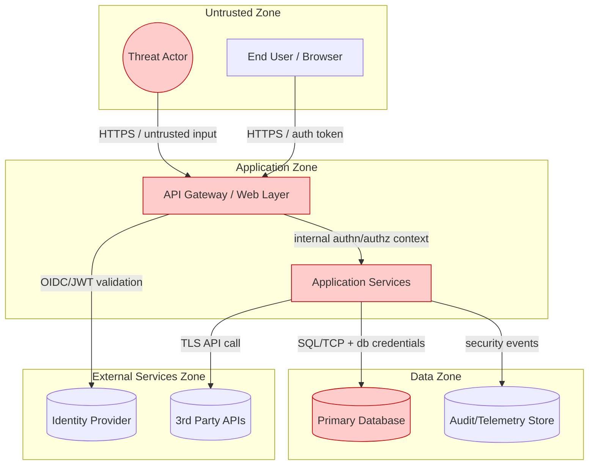
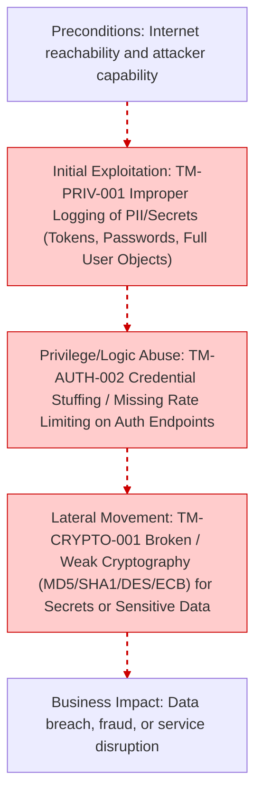

# Automated Threat Modeling and Security Scan Report

## Repository Identity

**GitHub Owner / Username:** yantongggg
**Repository Name:** FYP
**Full Repository Name:** yantongggg/FYP

**Organization:** mbbgrp
**Report Date:** 2026-03-03
**Report Version:** tm-scan v1.0.0
**Report ID:** 20260303_034126
**Report Classification:** Confidential

## SYSTEM CONTEXT

### Actors
- Authenticated User
- External Threat Actor
- Identity/Session Provider
- Internet User

### Assets
- Sensitive User/Secret Data (High) - 72 evidence indicator(s)
- Datastores (postgres, postgresql, users) (High)

### Trust boundaries & Assumptions
- Boundary 1: Internet to Application is untrusted.
- Boundary 2: Application to Data Layer is trusted-only via server authorization.
- Boundary 3: Application to External Services must use authenticated encrypted channels.
- All client input is untrusted until server-side validation succeeds.

## ARCHITECTURE MODEL

```mermaid
flowchart TD
    subgraph z1[Untrusted Zone]
        attacker((Threat Actor))
        user[End User / Browser]
    end

    subgraph z2[Application Zone]
        gateway[API Gateway / Web Layer]
        appsvc[Application Services]
    end

    subgraph z3[Data Zone]
        datastore[(Primary Database)]
        audit[(Audit/Telemetry Store)]
    end

    subgraph z4[External Services Zone]
        idp[(Identity Provider)]
        external[(3rd Party APIs)]
    end

    attacker -->|HTTPS / untrusted input| gateway
    user -->|HTTPS / auth token| gateway
    gateway -->|internal authn/authz context| appsvc
    appsvc -->|SQL/TCP + db credentials| datastore
    appsvc -->|security events| audit
    gateway -->|OIDC/JWT validation| idp
    appsvc -->|TLS API call| external

    classDef highRisk fill:#ffcccc,stroke:#cc0000;
    classDef mediumRisk fill:#ffe6cc,stroke:#cc7a00;
    class gateway highRisk;
    class appsvc highRisk;
    class datastore highRisk;
    class attacker highRisk;
```

## DATA FLOW MATRIX

| Source | Destination | Data type | Protocol | Crosses trust boundary (Y/N) |
|--------|-------------|-----------|----------|-------------------------------|
| API Gateway / Web Layer | Application Services | Validated Request Context | Internal HTTP/RPC | N |
| API Gateway / Web Layer | Identity Provider | JWT/OIDC Claims | HTTPS | Y |
| Application Services | Audit/Telemetry Store | Security Audit Events | Structured Logging | N |
| Application Services | Primary Database | PII + Business Records | SQL/TCP | Y |
| Internet User | API Gateway / Web Layer | Credentials + Request Data | HTTPS | Y |
| Runtime Configuration | Application Services | Secrets/Connection Strings | ENV/File | N |

## 5-D THREAT ANALYSIS (STRIDE + PASTA + LINDDUN + CWE + DREAD)

### [TM-PRIV-001] Improper Logging of PII/Secrets (Tokens, Passwords, Full User Objects)
**STRIDE & LINDDUN Categories & CWE Reference:** Information Disclosure | Detectability | CWE-532
**DREAD:** Damage=8, Reproducibility=9, Exploitability=7, AffectedUsers=9, Discoverability=8, Avg=8.20

**PASTA Attack Scenario:**
- Precondition: Insider or attacker with log access has access to Application logs, APM traces, centralized log stores
- Exploitation: Sensitive fields emitted without redaction
- Business Impact: Privacy breach, regulatory fines, incident response cost

**Evidence Table:**
| File Path | Line Number | Trigger | Severity |
|-----------|-------------|---------|----------|
| backend/app.py | - | password | HIGH |
| backend/routes/auth.py | - | password | HIGH |
| backend/utils/encryption_utils.py | - | password | HIGH |
| backend/utils/exportUtils.ts | - | console.log | LOW |
| backend/utils/supabase_manager.py | - | password | HIGH |
| evidence.json | - | console.log | LOW |
| evidence.json | - | password | HIGH |
| src/App.tsx | - | console.log | LOW |
| src/components/BehavioralMonitor.tsx | - | console.log | LOW |
| src/components/BehavioralMonitor.tsx | - | password | HIGH |
| src/components/BiometricCapture.tsx | - | console.log | LOW |
| src/components/ChatBot.tsx | - | console.log | LOW |
| src/components/ChatBot.tsx | - | password | HIGH |
| src/components/EKYCDocumentViewer.tsx | - | console.log | LOW |
| src/components/GlobalBehavioralWrapper.tsx | - | console.log | LOW |
| src/components/GlobalBehavioralWrapper.tsx | - | password | HIGH |
| src/components/ProtectedRoute.tsx | - | console.log | LOW |
| src/contexts/AuthContext.tsx | - | console.log | LOW |
| src/contexts/AuthContext.tsx | - | password | HIGH |
| src/lib/supabase.ts | - | password | HIGH |
| src/pages/AdminDashboard.tsx | - | console.log | LOW |
| src/pages/AdminEditAccount.tsx | - | password | HIGH |
| src/pages/BehavioralTestPage.tsx | - | console.log | LOW |
| src/pages/Documentation.tsx | - | console.log | LOW |
| src/pages/Documentation.tsx | - | password | HIGH |
| src/pages/EditProfile.tsx | - | console.log | LOW |
| src/pages/EditProfile.tsx | - | password | HIGH |
| src/pages/Login.tsx | - | console.log | LOW |
| src/pages/Login.tsx | - | password | HIGH |
| src/pages/Register.tsx | - | console.log | LOW |
| src/pages/Register.tsx | - | password | HIGH |
| src/pages/UserHome.tsx | - | console.log | LOW |
| src/pages/UserHome.tsx | - | password | HIGH |
| supabase/functions/local-chatbot/index.ts | - | password | HIGH |
| supabase/migrations/20250620102624_foggy_truth.sql | - | password | HIGH |
| supabase/migrations/20250626133933_late_crystal.sql | - | password | HIGH |

**Recommended Technical Mitigations:**
- Structured logging + field allowlists
- Redaction middleware for HTTP headers/body
- Secrets scanning on logs and APM payloads
- Python: enforce server-side validation using Pydantic/FastAPI validators and reject unsafe payload shapes.
- TypeScript/React: never trust client-side computed security/business fields; send minimal inputs and recalculate on server.
- TypeScript backend: apply strict schema validation (zod/joi) and centralized authorization middleware per route.
- Python/TS APIs: verify JWT signature, issuer, audience, expiry on every protected request.
- React/Python logs: redact Authorization headers, tokens, passwords, and PII at logger middleware.

### [TM-AUTH-002] Credential Stuffing / Missing Rate Limiting on Auth Endpoints
**STRIDE & LINDDUN Categories & CWE Reference:** Denial of Service | Detectability | CWE-307
**DREAD:** Damage=8, Reproducibility=9, Exploitability=8, AffectedUsers=8, Discoverability=8, Avg=8.20

**PASTA Attack Scenario:**
- Precondition: External attacker (botnet) has access to Login, token refresh, password reset, OTP endpoints
- Exploitation: High-rate brute force and credential stuffing
- Business Impact: Account takeover, auth outage, infra cost spike

**Evidence Table:**
| File Path | Line Number | Trigger | Severity |
|-----------|-------------|---------|----------|
| backend/routes/auth.py | - | authenticate | MEDIUM |
| evidence.json | - | authenticate | MEDIUM |
| src/App.tsx | - | authenticate | MEDIUM |
| src/components/ChatBot.tsx | - | authenticate | MEDIUM |
| src/pages/Documentation.tsx | - | authenticate | MEDIUM |
| supabase/functions/local-chatbot/index.ts | - | authenticate | MEDIUM |
| supabase/migrations/20250620102624_foggy_truth.sql | - | authenticate | MEDIUM |
| supabase/migrations/20250624130544_copper_cell.sql | - | authenticate | MEDIUM |
| supabase/migrations/20250624130931_dawn_smoke.sql | - | authenticate | MEDIUM |
| supabase/migrations/20250626133933_late_crystal.sql | - | authenticate | MEDIUM |

**Recommended Technical Mitigations:**
- IP + account throttling
- Credential stuffing detection (known breached passwords, velocity checks)
- Step-up MFA for risky logins
- Python: enforce server-side validation using Pydantic/FastAPI validators and reject unsafe payload shapes.
- TypeScript/React: never trust client-side computed security/business fields; send minimal inputs and recalculate on server.
- TypeScript backend: apply strict schema validation (zod/joi) and centralized authorization middleware per route.
- Python/TS APIs: verify JWT signature, issuer, audience, expiry on every protected request.
- Python/TS gateway: enforce IP + account rate-limits, lockout/backoff, and anomaly detection.

### [TM-CRYPTO-001] Broken / Weak Cryptography (MD5/SHA1/DES/ECB) for Secrets or Sensitive Data
**STRIDE & LINDDUN Categories & CWE Reference:** Information Disclosure | Linkability | CWE-327
**DREAD:** Damage=9, Reproducibility=8, Exploitability=7, AffectedUsers=9, Discoverability=7, Avg=8.00

**PASTA Attack Scenario:**
- Precondition: External attacker or insider has access to Password storage, token derivation, encryption at rest, backups
- Exploitation: Offline cracking; ciphertext pattern analysis
- Business Impact: Account compromise, regulatory breach, reputational damage

**Evidence Table:**
| File Path | Line Number | Trigger | Severity |
|-----------|-------------|---------|----------|
| backend/app.py | - | bcrypt | MEDIUM |
| backend/routes/auth.py | - | bcrypt | MEDIUM |
| backend/utils/supabase_manager.py | - | bcrypt | MEDIUM |
| evidence.json | - | bcrypt | MEDIUM |
| package-lock.json | - | bcrypt | MEDIUM |
| package.json | - | bcrypt | MEDIUM |
| src/contexts/AuthContext.tsx | - | bcrypt | MEDIUM |

**Recommended Technical Mitigations:**
- Ban weak algorithms by policy/lint
- Use AEAD modes (AES-GCM)
- Centralize crypto utilities and key management (KMS/HSM)
- Python: enforce server-side validation using Pydantic/FastAPI validators and reject unsafe payload shapes.
- TypeScript/React: never trust client-side computed security/business fields; send minimal inputs and recalculate on server.
- TypeScript backend: apply strict schema validation (zod/joi) and centralized authorization middleware per route.
- React/Python logs: redact Authorization headers, tokens, passwords, and PII at logger middleware.

### [TM-BIZ-001] Client-Side Trust of Financial Fields (Price/Quantity/Risk Score Manipulation)
**STRIDE & LINDDUN Categories & CWE Reference:** Tampering | Unawareness | CWE-602
**DREAD:** Damage=10, Reproducibility=7, Exploitability=7, AffectedUsers=8, Discoverability=6, Avg=7.60

**PASTA Attack Scenario:**
- Precondition: Fraudster has access to Checkout, payout, underwriting, risk scoring APIs
- Exploitation: Modify client parameters, replay requests
- Business Impact: Financial loss, AML/KYC violations, chargebacks

**Evidence Table:**
| File Path | Line Number | Trigger | Severity |
|-----------|-------------|---------|----------|
| evidence.json | - | risk_score | HIGH |

**Recommended Technical Mitigations:**
- Server-side recalculation of totals and risk
- Signed quotes and expiry for price offers
- Fraud monitoring for abnormal deltas
- Python: enforce server-side validation using Pydantic/FastAPI validators and reject unsafe payload shapes.
- TypeScript/React: never trust client-side computed security/business fields; send minimal inputs and recalculate on server.
- TypeScript backend: apply strict schema validation (zod/joi) and centralized authorization middleware per route.

## PASTA ANALYSIS (Attack Trees & Paths)

```mermaid
flowchart TD
    a0[Preconditions: Internet reachability and attacker capability]
    a1["Initial Exploitation: TM-PRIV-001 Improper Logging of PII/Secrets (Tokens, Passwords, Full User Objects)"]
    a2["Privilege/Logic Abuse: TM-AUTH-002 Credential Stuffing / Missing Rate Limiting on Auth Endpoints"]
    a3["Lateral Movement: TM-CRYPTO-001 Broken / Weak Cryptography (MD5/SHA1/DES/ECB) for Secrets or Sensitive Data"]
    a4[Business Impact: Data breach, fraud, or service disruption]

    a0 -.-> a1
    a1 -.-> a2
    a2 -.-> a3
    a3 -.-> a4

    classDef highRisk fill:#ffcccc,stroke:#cc0000;
    class a1 highRisk;
    class a2 highRisk;
    class a3 highRisk;
    linkStyle 0 stroke:#cc0000,stroke-width:2px,stroke-dasharray: 5 5;
    linkStyle 1 stroke:#cc0000,stroke-width:2px,stroke-dasharray: 5 5;
    linkStyle 2 stroke:#cc0000,stroke-width:2px,stroke-dasharray: 5 5;
    linkStyle 3 stroke:#cc0000,stroke-width:2px,stroke-dasharray: 5 5;
```

## RISK SUMMARY

| Threat ID | Risk Level | DREAD Avg | Mitigation Priority |
|-----------|------------|-----------|---------------------|
| TM-PRIV-001 | Critical | 8.20 | P0 - Immediate |
| TM-AUTH-002 | High | 8.20 | P1 - Current Sprint |
| TM-CRYPTO-001 | High | 8.00 | P1 - Current Sprint |
| TM-BIZ-001 | Critical | 7.60 | P0 - Immediate |

---

*Secret Findings (gitleaks): 0*
*Total Packages (SBOM): 0*
*Report generated by tm-scan v1.0.0 on 2026-03-03 03:41:27*
*Automated output from static analysis; manual security review is required.*
