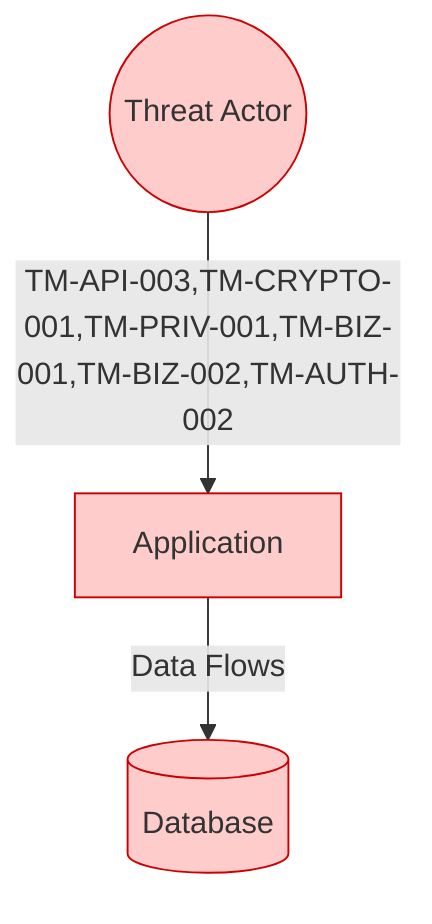

# Automated Threat Modeling and Security Scan Report

**Repository:** target-repo
**Organization:** mbbgrp
**Report Date:** 2026-03-03
**Report Version:** tm-scan v1.0.0
**Report ID:** 20260303_024221
**Report Classification:** Confidential

## Architecture Overview

## Scan Metadata

- **Scan Mode:** quick
- **Since Days:** 30
- **Git Depth:** 1

## Executive Summary

**Overall Risk Level:** High

- **Total Evidence Findings:** 207
- **Rule Hits:** 5
- **High-Priority Keywords:** 69
- **Secret Findings (gitleaks):** 0
- **Total Packages (SBOM):** 0
- **OpenAPI Specs Found:** 0
- **DB Migration Files:** 0

### Risk Level Summary

| Severity | Count |
|----------|-------|
| CRITICAL | 5 |
| HIGH | 0 |
| MEDIUM | 0 |
| LOW | 0 |

### STRIDE Distribution

| STRIDE Category | Count |
|-----------------|-------|
| Spoofing | 0 |
| Tampering | 3 |
| Repudiation | 0 |
| Information Disclosure | 2 |
| Denial of Service | 1 |
| Elevation of Privilege | 0 |

## Detailed Threat Models

### [TM-API-003] SQL Injection via String Concatenation / Unsafe Query Construction
**STRIDE Category:** Tampering | **Default Impact:** Critical | **CWE References:** N/A

**Description:**
Concatenating untrusted input into SQL queries allows injection, data exfiltration, and corruption.

**Evidence:**
No rule-based evidence captured.

**Recommended Controls:**
- Prepared statements everywhere
- Centralize query building; ban raw concatenation by linting
- Least-privileged DB roles

**Questions for Review:**
- Do any queries build SQL via concat/format/interpolation?
- Are raw ORM queries audited and parameterized?

### [TM-CRYPTO-001] Broken / Weak Cryptography (MD5/SHA1/DES/ECB) for Secrets or Sensitive Data
**STRIDE Category:** Information Disclosure | **Default Impact:** High | **CWE References:** N/A

**Description:**
Use of outdated hashing/encryption algorithms or insecure modes enables offline cracking and data compromise.

**Evidence:**
No rule-based evidence captured.

**Recommended Controls:**
- Ban weak algorithms by policy/lint
- Use AEAD modes (AES-GCM)
- Centralize crypto utilities and key management (KMS/HSM)

**Questions for Review:**
- Are passwords stored using bcrypt/Argon2 with per-user salts?
- Is any AES used in ECB/CBC without authentication?

### [TM-PRIV-001] Improper Logging of PII/Secrets (Tokens, Passwords, Full User Objects)
**STRIDE Category:** Information Disclosure | **Default Impact:** High | **CWE References:** N/A

**Description:**
Logs include raw PII (email, SSN, phone), credentials, or tokens, violating privacy and compliance controls.

**Evidence:**
No rule-based evidence captured.

**Recommended Controls:**
- Structured logging + field allowlists
- Redaction middleware for HTTP headers/body
- Secrets scanning on logs and APM payloads

**Questions for Review:**
- Are Authorization headers or tokens ever logged?
- Do we log full request/response bodies in production?

### [TM-BIZ-001] Client-Side Trust of Financial Fields (Price/Quantity/Risk Score Manipulation)
**STRIDE Category:** Tampering | **Default Impact:** Critical | **CWE References:** N/A

**Description:**
Server trusts client-supplied price/quantity/risk fields, enabling fraud by parameter tampering.

**Evidence:**
No rule-based evidence captured.

**Recommended Controls:**
- Server-side recalculation of totals and risk
- Signed quotes and expiry for price offers
- Fraud monitoring for abnormal deltas

**Questions for Review:**
- Do we ever persist client-provided totals or risk scores?
- Are promotions/coupons validated server-side?

### [TM-BIZ-002] KYC/AML Gate Bypass via Parameter Tampering or Workflow Skips
**STRIDE Category:** Tampering | **Default Impact:** Critical | **CWE References:** N/A

**Description:**
KYC/AML enforcement can be bypassed if state flags are client-controlled or not enforced at payout/withdrawal time.

**Evidence:**
No rule-based evidence captured.

**Recommended Controls:**
- Server-side gates at payout/withdrawal
- Immutable audit trail + dual control for overrides
- Least privilege for internal compliance APIs

**Questions for Review:**
- Can payouts occur without AML/KYC = passed/clear?
- Are overrides dual-controlled and logged?

### [TM-AUTH-002] Credential Stuffing / Missing Rate Limiting on Auth Endpoints
**STRIDE Category:** Denial of Service | **Default Impact:** High | **CWE References:** N/A

**Description:**
Authentication endpoints lack throttling and abuse protections, enabling credential stuffing and resource exhaustion.

**Evidence:**
No rule-based evidence captured.

**Recommended Controls:**
- IP + account throttling
- Credential stuffing detection (known breached passwords, velocity checks)
- Step-up MFA for risky logins

**Questions for Review:**
- Do we throttle by IP and by account identifier?
- Do we have lockout/backoff and 2FA/step-up flows?

## Asset/Flow Inventory

| Asset/Flow | Confidentiality | Integrity | Availability | Sensitivity | Evidence | Notes |
|------------|-----------------|-----------|--------------|-------------|----------|-------|
| User Data (USERS table) | High | High | Medium | High | 6 reference(s) | Contains PII - check for encryption |
| Database (ojdbc) | High | High | High | High | 1 reference(s) | Check connection string security |
| Database (redis) | High | High | High | High | 2 reference(s) | Check connection string security |
| Database (postgres) | High | High | High | High | 2 reference(s) | Check connection string security |
| Risk Assessment Engine | Medium | High | High | High | 8 reference(s) | PATCH-SPECIFIC: Verify server-side calculation |
| Date/Time Validation | Low | High | Medium | Medium | 11 reference(s) | PATCH-SPECIFIC: Verify server-side validation |
| Transaction Processing | Medium | High | High | High | 3 reference(s) | PATCH-SPECIFIC: Verify hold enforcement |
| Authentication System | Medium | High | High | High | 14 type(s) | rbac, @secured, openid, csrf, jwt |

## Threat Analysis

| Threat | STRIDE Category | Likelihood | Impact | Priority | Evidence | Recommended Controls | Questions to Confirm |
|--------|-----------------|------------|--------|----------|----------|----------------------|----------------------|
| SQL Injection via String Concatenation / Unsafe Query Construction | Tampering | High | Critical | TBD | keywords: 2, rules: 0 | Prepared statements everywhere; Centralize quer... | Do any queries build SQL via concat/format/inte... |
| Broken / Weak Cryptography (MD5/SHA1/DES/ECB) for Secrets or Sensitive Data | Information Disclosure | Medium | High | TBD | keywords: 2, rules: 0 | Ban weak algorithms by policy/lint; Use AEAD mo... | Are passwords stored using bcrypt/Argon2 with p... |
| Improper Logging of PII/Secrets (Tokens, Passwords, Full User Objects) | Information Disclosure | High | High | TBD | keywords: 2, rules: 0 | Structured logging + field allowlists; Redactio... | Are Authorization headers or tokens ever logged? |
| Client-Side Trust of Financial Fields (Price/Quantity/Risk Score Manipulation) | Tampering | High | Critical | TBD | keywords: 2, rules: 0 | Server-side recalculation of totals and risk; S... | Do we ever persist client-provided totals or ri... |
| KYC/AML Gate Bypass via Parameter Tampering or Workflow Skips | Tampering | Medium | Critical | TBD | keywords: 2, rules: 0 | Server-side gates at payout/withdrawal; Immutab... | Can payouts occur without AML/KYC = passed/clear? |
| Credential Stuffing / Missing Rate Limiting on Auth Endpoints | Denial of Service | High | High | TBD | keywords: 1, rules: 0 | IP + account throttling; Credential stuffing de... | Do we throttle by IP and by account identifier? |

## STRIDE Analysis

### Spoofing

**Indicators Found (30):**
- authenticate
- jsonwebtoken
- jwt
- login
- oauth
- oidc
- openid
- password
- session
- ... and 20 more

### Tampering

**Indicators Found (28):**
- 10m
- 1h
- 24h
- 30m
- 4h
- 7d
- hold_transaction
- holdtransaction
- max_risk_score
- maxriskscore
- ... and 18 more

### Repudiation

**Indicators Found (15):**
- console.log
- log.error
- log.info
- logger.
- print(
- ... and 5 more

### Information Disclosure

**Indicators Found (42):**
- api_key
- apikey
- connection_string
- connectionstring
- jdbc:oracle
- mongodb
- mysql
- ojdbc
- oracle
- password=
- ... and 32 more

### Denial of Service

**Indicators Found (9):**
- @deletemapping
- @getmapping
- @postmapping
- @putmapping
- @requestmapping
- @restcontroller
- app.get(
- app.post(
- router.

### Elevation of Privilege

**Indicators Found (5):**
- @preauthorize
- @rolesallowed
- @secured
- rbac

## Recommendations

### [HIGH] Review 69 high-priority code patterns

Patch-specific keywords detected. Verify server-side validation and business logic enforcement.

### [HIGH] Review database connection security

Ensure credentials are stored in environment variables or a secret manager. Use least-privilege database accounts.

### [MEDIUM] Verify authentication/authorization implementation

38 auth-related indicators found. Ensure MFA, proper session management, and JWT validation.

### [LOW] Implement comprehensive audit logging

Log all security-relevant events with user identity, timestamp, and action. Ensure logs are tamper-evident.

## Questions for Security Reviewers

Please confirm the following during review:

1. Do we ever persist client-provided totals or risk scores?
2. Are promotions/coupons validated server-side?
3. Do we throttle by IP and by account identifier?
4. Do we have lockout/backoff and 2FA/step-up flows?
5. Are Authorization headers or tokens ever logged?
6. Do we log full request/response bodies in production?
7. Do any queries build SQL via concat/format/interpolation?
8. Are raw ORM queries audited and parameterized?
9. Can payouts occur without AML/KYC = passed/clear?
10. Are overrides dual-controlled and logged?
11. Are passwords stored using bcrypt/Argon2 with per-user salts?
12. Is any AES used in ECB/CBC without authentication?
13. Is PVF_DATE (and all date fields) validated server-side?
14. Are risk scores calculated server-side only?
15. Are transaction holds enforced in the database (not client-side)?
16. Are database credentials stored in a secret manager or environment variables?
17. Is MFA implemented for sensitive operations?
18. Are JWT signatures validated on every request?

---

*Report generated by tm-scan v1.0.0 on 2026-03-03 02:42:21*
*This is an automated threat model report based on static analysis. Manual review required.*
