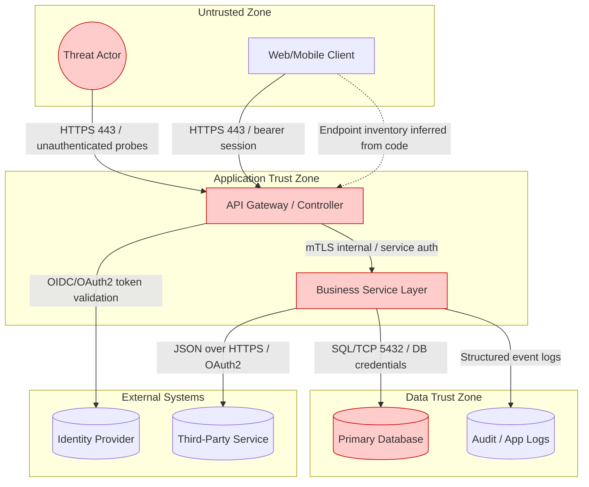
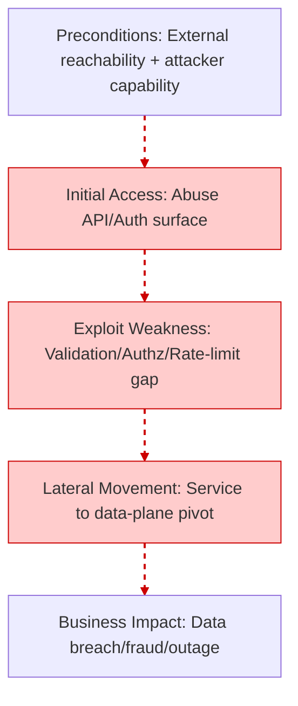

# Automated Threat Modeling and Security Scan Report

**Repository:** target-repo
**Organization:** mbbgrp
**Report Date:** 2026-03-03
**Report Version:** tm-scan v1.0.0
**Report ID:** 20260303_030432
**Report Classification:** Confidential

## Scan Metadata

- **Scan Mode:** quick
- **Since Days:** 30
- **Git Depth:** 1
- **Keyword Hits:** 368
- **Rule Hits:** 5
- **SAST Hits (line-level):** 7
- **OpenAPI Specs Found:** 0
- **DB Migration Files:** 0
- **Secret Findings (gitleaks):** 0
- **Total Packages (SBOM):** 0

## SYSTEM CONTEXT

### Actors
- Authenticated User
- External Attacker
- Identity Provider / Session Authority
- Unauthenticated Internet User

### Assets
- User/PII Data (High sensitivity) - 25 evidence indicator(s)
- Credentials/Secrets (High sensitivity) - 29 evidence indicator(s)
- Datastores (connection_string, connectionstring, jdbc:oracle, mongodb, mysql, ojdbc, oracle, postgres, postgresql, redis, users) (High sensitivity)

### Entry points
- Authentication-related endpoints/signals: @preauthorize, @rolesallowed, @secured, authenticate, csrf, jsonwebtoken, jwt, login

### Trust boundaries & Assumptions
- Internet -> Application boundary is untrusted by default.
- Application -> Data store boundary is privileged and must enforce least privilege.
- Application -> External services boundary assumes network egress controls and TLS.
- All client-supplied business fields are treated as untrusted until server validation.

## ARCHITECTURE MODEL

## DATA FLOW MATRIX

| Source | Destination | Data type | Protocol | Authentication | Crosses trust boundary (Y/N) |
|--------|-------------|-----------|----------|----------------|-------------------------------|
| API Gateway / Controller | Business Service Layer | Validated Domain Request | Internal RPC/HTTP | Service Identity | N |
| API Gateway / Controller | Identity Provider | Token Introspection / Claims | HTTPS | OAuth2/OIDC | Y |
| Application Config | Business Service Layer | Connection Strings / Secrets | Env/File | Runtime Process Access | N |
| Business Service Layer | Audit / App Logs | Security Events | Structured Logging | N/A | N |
| Business Service Layer | Primary Database | PII/Business Records | SQL/TCP | DB Credential | Y |
| External User | API Gateway / Controller | Credentials + Request Payload | HTTPS | Session/JWT | Y |

## 5-D THREAT ANALYSIS (STRIDE + LINDDUN + CWE + DREAD)

### [TM-PRIV-001] Improper Logging of PII/Secrets (Tokens, Passwords, Full User Objects)
**STRIDE & LINDDUN Categories:** Information Disclosure | Detectability
**CWE Reference:** CWE-532
**DREAD Score Breakdown:** Damage=8, Reproducibility=9, Exploitability=7, Affected Users=9, Discoverability=8 (Avg=8.20)

**Attack Scenario & Business Impact (PASTA Context)**
- Preconditions: Insider or attacker with log access has access to Application logs, APM traces, centralized log stores. Exploitation: Sensitive fields emitted without redaction is abused using observed code evidence.
- Business Impact: Privacy breach, regulatory fines, incident response cost

**Evidence Table**
| File Path | Line Number | Rule/Keyword | Severity |
|-----------|-------------|--------------|----------|
| README.md | unknown | password | HIGH |
| ThreatModelling_result/threatmodel-report_2026-03-03_02-42-22.md | unknown | password | HIGH |
| ThreatModelling_result/threatmodel-report_2026-03-03_02-42-22.md | unknown | console.log | LOW |
| ThreatModelling_result/threatmodel-report_2026-03-03_02-44-45.md | unknown | password | HIGH |
| ThreatModelling_result/threatmodel-report_2026-03-03_02-44-45.md | unknown | console.log | LOW |
| ThreatModelling_result/threatmodel-report_2026-03-03_02-58-19.md | unknown | password | HIGH |
| ThreatModelling_result/threatmodel-report_2026-03-03_02-58-19.md | unknown | console.log | LOW |
| knowledge-base/kb-keywords.yaml | unknown | password | HIGH |
| knowledge-base/kb-keywords.yaml | unknown | console.log | LOW |
| knowledge-base/kb-sast-rules.yaml | unknown | password | HIGH |
| knowledge-base/kb-threats.yaml | unknown | password | HIGH |
| knowledge-base/kb-threats.yaml | unknown | console.log | LOW |
| src/reporter.py | unknown | password | HIGH |

**Recommended Technical Mitigations (Implementable)**
- Structured logging + field allowlists
- Redaction middleware for HTTP headers/body
- Secrets scanning on logs and APM payloads

### [TM-BIZ-001] Client-Side Trust of Financial Fields (Price/Quantity/Risk Score Manipulation)
**STRIDE & LINDDUN Categories:** Tampering | Unawareness
**CWE Reference:** CWE-602
**DREAD Score Breakdown:** Damage=10, Reproducibility=7, Exploitability=7, Affected Users=8, Discoverability=6 (Avg=7.60)

**Attack Scenario & Business Impact (PASTA Context)**
- Preconditions: Fraudster has access to Checkout, payout, underwriting, risk scoring APIs. Exploitation: Modify client parameters, replay requests is abused using observed code evidence.
- Business Impact: Financial loss, AML/KYC violations, chargebacks

**Evidence Table**
| File Path | Line Number | Rule/Keyword | Severity |
|-----------|-------------|--------------|----------|
| README.md | unknown | risk_score | HIGH |
| ThreatModelling_result/threatmodel-report_2026-03-03_02-42-22.md | unknown | maxriskscore | HIGH |
| ThreatModelling_result/threatmodel-report_2026-03-03_02-42-22.md | unknown | risk_score | HIGH |
| ThreatModelling_result/threatmodel-report_2026-03-03_02-44-45.md | unknown | maxriskscore | HIGH |
| ThreatModelling_result/threatmodel-report_2026-03-03_02-44-45.md | unknown | risk_score | HIGH |
| ThreatModelling_result/threatmodel-report_2026-03-03_02-58-19.md | unknown | maxriskscore | HIGH |
| ThreatModelling_result/threatmodel-report_2026-03-03_02-58-19.md | unknown | risk_score | HIGH |
| knowledge-base/kb-keywords.yaml | unknown | maxriskscore | HIGH |
| knowledge-base/kb-keywords.yaml | unknown | risk_score | HIGH |
| knowledge-base/kb-threats.yaml | unknown | maxriskscore | HIGH |
| knowledge-base/kb-threats.yaml | unknown | risk_score | HIGH |

**Recommended Technical Mitigations (Implementable)**
- Server-side recalculation of totals and risk
- Signed quotes and expiry for price offers
- Fraud monitoring for abnormal deltas

### [TM-API-003] SQL Injection via String Concatenation / Unsafe Query Construction
**STRIDE & LINDDUN Categories:** Tampering | Non-repudiation
**CWE Reference:** CWE-89
**DREAD Score Breakdown:** Damage=10, Reproducibility=9, Exploitability=8, Affected Users=9, Discoverability=8 (Avg=8.80)

**Attack Scenario & Business Impact (PASTA Context)**
- Preconditions: External attacker has access to Search/filter endpoints, admin panels, report generators. Exploitation: Injected payloads via query params/body fields is abused using observed code evidence.
- Business Impact: PII leakage, financial loss, database compromise

**Evidence Table**
| File Path | Line Number | Rule/Keyword | Severity |
|-----------|-------------|--------------|----------|
| README.md | unknown | statement | MEDIUM |
| ThreatModelling_result/threatmodel-report_2026-03-03_02-42-22.md | unknown | statement | MEDIUM |
| ThreatModelling_result/threatmodel-report_2026-03-03_02-44-45.md | unknown | statement | MEDIUM |
| ThreatModelling_result/threatmodel-report_2026-03-03_02-58-19.md | unknown | executequery | MEDIUM |
| ThreatModelling_result/threatmodel-report_2026-03-03_02-58-19.md | unknown | statement | MEDIUM |
| knowledge-base/kb-keywords.yaml | unknown | executequery | MEDIUM |
| knowledge-base/kb-keywords.yaml | unknown | statement | MEDIUM |
| knowledge-base/kb-sast-rules.yaml | unknown | statement | MEDIUM |
| knowledge-base/kb-threats.yaml | unknown | executequery | MEDIUM |
| knowledge-base/kb-threats.yaml | unknown | statement | MEDIUM |

**Recommended Technical Mitigations (Implementable)**
- Prepared statements everywhere
- Centralize query building; ban raw concatenation by linting
- Least-privileged DB roles

### [TM-CRYPTO-001] Broken / Weak Cryptography (MD5/SHA1/DES/ECB) for Secrets or Sensitive Data
**STRIDE & LINDDUN Categories:** Information Disclosure | Linkability
**CWE Reference:** CWE-327
**DREAD Score Breakdown:** Damage=9, Reproducibility=8, Exploitability=7, Affected Users=9, Discoverability=7 (Avg=8.00)

**Attack Scenario & Business Impact (PASTA Context)**
- Preconditions: External attacker or insider has access to Password storage, token derivation, encryption at rest, backups. Exploitation: Offline cracking; ciphertext pattern analysis is abused using observed code evidence.
- Business Impact: Account compromise, regulatory breach, reputational damage

**Evidence Table**
| File Path | Line Number | Rule/Keyword | Severity |
|-----------|-------------|--------------|----------|
| ThreatModelling_result/threatmodel-report_2026-03-03_02-42-22.md | unknown | argon2 | MEDIUM |
| ThreatModelling_result/threatmodel-report_2026-03-03_02-42-22.md | unknown | bcrypt | MEDIUM |
| ThreatModelling_result/threatmodel-report_2026-03-03_02-44-45.md | unknown | argon2 | MEDIUM |
| ThreatModelling_result/threatmodel-report_2026-03-03_02-44-45.md | unknown | bcrypt | MEDIUM |
| ThreatModelling_result/threatmodel-report_2026-03-03_02-58-19.md | unknown | argon2 | MEDIUM |
| ThreatModelling_result/threatmodel-report_2026-03-03_02-58-19.md | unknown | bcrypt | MEDIUM |
| knowledge-base/kb-keywords.yaml | unknown | argon2 | MEDIUM |
| knowledge-base/kb-keywords.yaml | unknown | bcrypt | MEDIUM |
| knowledge-base/kb-threats.yaml | unknown | argon2 | MEDIUM |
| knowledge-base/kb-threats.yaml | unknown | bcrypt | MEDIUM |

**Recommended Technical Mitigations (Implementable)**
- Ban weak algorithms by policy/lint
- Use AEAD modes (AES-GCM)
- Centralize crypto utilities and key management (KMS/HSM)

### [TM-AUTH-002] Credential Stuffing / Missing Rate Limiting on Auth Endpoints
**STRIDE & LINDDUN Categories:** Denial of Service | Detectability
**CWE Reference:** CWE-307
**DREAD Score Breakdown:** Damage=8, Reproducibility=9, Exploitability=8, Affected Users=8, Discoverability=8 (Avg=8.20)

**Attack Scenario & Business Impact (PASTA Context)**
- Preconditions: External attacker (botnet) has access to Login, token refresh, password reset, OTP endpoints. Exploitation: High-rate brute force and credential stuffing is abused using observed code evidence.
- Business Impact: Account takeover, auth outage, infra cost spike

**Evidence Table**
| File Path | Line Number | Rule/Keyword | Severity |
|-----------|-------------|--------------|----------|
| README.md | unknown | authenticate | MEDIUM |
| ThreatModelling_result/threatmodel-report_2026-03-03_02-42-22.md | unknown | authenticate | MEDIUM |
| ThreatModelling_result/threatmodel-report_2026-03-03_02-44-45.md | unknown | authenticate | MEDIUM |
| ThreatModelling_result/threatmodel-report_2026-03-03_02-58-19.md | unknown | authenticate | MEDIUM |
| knowledge-base/kb-keywords.yaml | unknown | authenticate | MEDIUM |
| knowledge-base/kb-threats.yaml | unknown | authenticate | MEDIUM |
| src/inventory.py | unknown | authenticate | MEDIUM |
| src/reporter.py | unknown | authenticate | MEDIUM |

**Recommended Technical Mitigations (Implementable)**
- IP + account throttling
- Credential stuffing detection (known breached passwords, velocity checks)
- Step-up MFA for risky logins

### [TM-BIZ-002] KYC/AML Gate Bypass via Parameter Tampering or Workflow Skips
**STRIDE & LINDDUN Categories:** Tampering | Unawareness
**CWE Reference:** CWE-285
**DREAD Score Breakdown:** Damage=10, Reproducibility=6, Exploitability=6, Affected Users=9, Discoverability=6 (Avg=7.40)

**Attack Scenario & Business Impact (PASTA Context)**
- Preconditions: Fraudster or compromised insider account has access to Payout, withdrawal, onboarding, compliance APIs. Exploitation: Tampering with approval flags or calling internal endpoints is abused using observed code evidence.
- Business Impact: Illicit payouts, regulatory exposure, sanctions risk

**Evidence Table**
| File Path | Line Number | Rule/Keyword | Severity |
|-----------|-------------|--------------|----------|
| ThreatModelling_result/threatmodel-report_2026-03-03_02-42-22.md | unknown | hold_transaction | HIGH |
| ThreatModelling_result/threatmodel-report_2026-03-03_02-44-45.md | unknown | hold_transaction | HIGH |
| ThreatModelling_result/threatmodel-report_2026-03-03_02-58-19.md | unknown | hold_transaction | HIGH |
| ThreatModelling_result/threatmodel-report_2026-03-03_02-58-19.md | unknown | previous_review | HIGH |
| knowledge-base/kb-keywords.yaml | unknown | hold_transaction | HIGH |
| knowledge-base/kb-keywords.yaml | unknown | previous_review | HIGH |
| knowledge-base/kb-threats.yaml | unknown | hold_transaction | HIGH |
| knowledge-base/kb-threats.yaml | unknown | previous_review | HIGH |

**Recommended Technical Mitigations (Implementable)**
- Server-side gates at payout/withdrawal
- Immutable audit trail + dual control for overrides
- Least privilege for internal compliance APIs

## PASTA ANALYSIS (Attack Trees & Paths)

- **Preconditions:** External attacker can reach API entry points and submit crafted inputs
- **Exploited Weaknesses:** TM-PRIV-001 (Improper Logging of PII/Secrets (Tokens, Passwords, Full User Objects)); TM-BIZ-001 (Client-Side Trust of Financial Fields (Price/Quantity/Risk Score Manipulation)); TM-API-003 (SQL Injection via String Concatenation / Unsafe Query Construction)
- **Lateral Movement:** Pivot from API layer to service/data layer via weak validation/authz/rate-limit controls
- **Business Impact:** Data exposure, service abuse, and material business loss

## RISK SUMMARY & QUALITY GATE TABLE

| Threat ID | Risk Level | DREAD Avg | Business Impact | Mitigation Priority |
|-----------|------------|-----------|-----------------|---------------------|
| TM-PRIV-001 | Critical | 8.20 | Privacy breach, regulatory fines, incident response cost | P0 - Immediate |
| TM-BIZ-001 | Critical | 7.60 | Financial loss, AML/KYC violations, chargebacks | P0 - Immediate |
| TM-API-003 | Critical | 8.80 | PII leakage, financial loss, database compromise | P0 - Immediate |
| TM-CRYPTO-001 | High | 8.00 | Account compromise, regulatory breach, reputational damage | P1 - Current Sprint |
| TM-AUTH-002 | High | 8.20 | Account takeover, auth outage, infra cost spike | P1 - Current Sprint |
| TM-BIZ-002 | Critical | 7.40 | Illicit payouts, regulatory exposure, sanctions risk | P0 - Immediate |

---

*Report generated by tm-scan v1.0.0 on 2026-03-03 03:04:33*
*This is an automated threat model report based on static analysis. Manual review required.*
