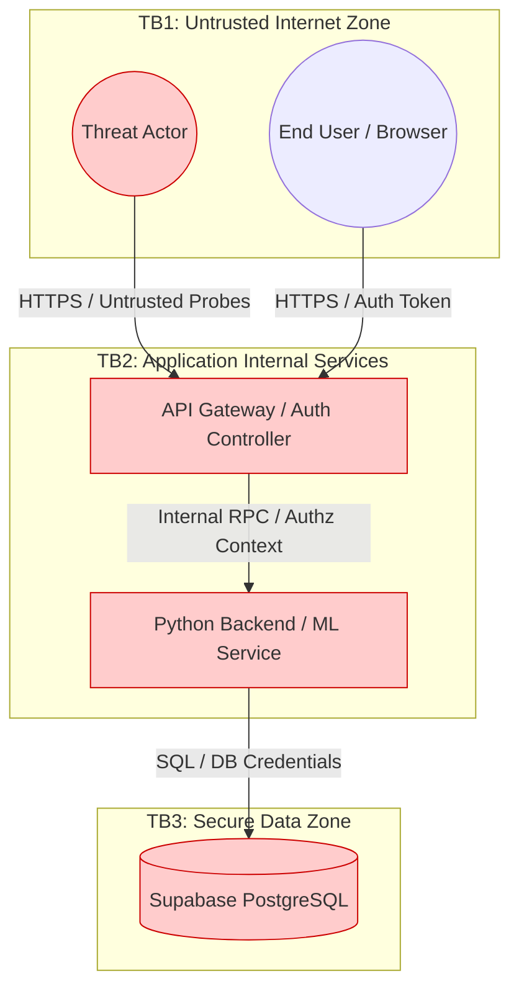
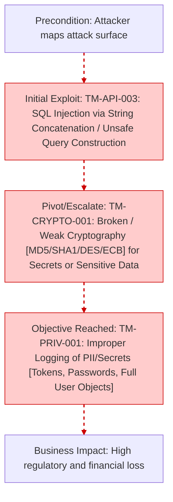

# Enterprise Threat Modeling & Security Audit

## Repository Identity
**GitHub Owner / Username:** yantongggg
**Repository Name:** TM_o31
**Report Date:** 2026-03-03 04:01:08
**Report Version:** tm-scan v1.0.0
**Classification:** Highly Confidential

## 1. SYSTEM CONTEXT

### Actors
- Authenticated End User
- External Threat Actor
- Identity & Access Management (IAM)

### Assets
- Sensitive User/PII Data (High Value) - 22 evidence trace(s)
- Authentication Context/Tokens (High Value) - 33 evidence trace(s)

### Trust Boundaries & Assumptions
- **Boundary 1:** Internet to Application Gateway is inherently untrusted.
- **Boundary 2:** API Layer to Data Store relies on strict server-side authorization.
- **Assumption:** Client-side biometric/eKYC controls can be bypassed; server-side validation is mandatory.

## 2. ARCHITECTURE MODEL

## 3. DATA FLOW MATRIX

| Source | Destination | Data Type | Protocol | Auth | Crosses Trust Boundary? |
|--------|-------------|-----------|----------|------|-------------------------|
| Frontend Client | API Gateway | User/eKYC Payload | HTTPS | JWT | **Yes** |
| API Gateway | ML Backend | Image/Biometric Data | Internal RPC | Service | No |
| Backend Service | Database | SQL Queries / PII | TCP/5432 | Password | **Yes** |
| App Config | Runtime | DB Secrets / API Keys | ENV | OS Level | No |

## 4. 5-D THREAT ANALYSIS (STRIDE + PASTA + LINDDUN + CWE + DREAD)

### [TM-API-003] SQL Injection via String Concatenation / Unsafe Query Construction
**STRIDE / LINDDUN:** Tampering / Non-repudiation | **CWE:** CWE-89
**DREAD Score:** Damage=10, Repro=9, Exploit=8, Users=9, Discover=8 (Avg: 8.80)

**PASTA Attack Scenario:**
- **Precondition:** Search/filter endpoints, admin panels, report generators
- **Exploitation:** Injected payloads via query params/body fields
- **Business Impact:** PII leakage, financial loss, database compromise

**Evidence Context (Actionable Trace):**
| File Path | Exact Line | Trigger (Rule/Keyword) | Severity |
|-----------|------------|------------------------|----------|
| `knowledge-base/kb-keywords.yaml` | - | Keyword: `executequery` | MEDIUM |
| `knowledge-base/kb-keywords.yaml` | - | Keyword: `statement` | MEDIUM |
| `knowledge-base/kb-sast-rules.yaml` | - | Keyword: `statement` | MEDIUM |
| `knowledge-base/kb-threats.yaml` | - | Keyword: `executequery` | MEDIUM |
| `knowledge-base/kb-threats.yaml` | - | Keyword: `statement` | MEDIUM |

**Mitigation Requirements:**
- Prepared statements everywhere
- Centralize query building; ban raw concatenation by linting
- Least-privileged DB roles

### [TM-CRYPTO-001] Broken / Weak Cryptography (MD5/SHA1/DES/ECB) for Secrets or Sensitive Data
**STRIDE / LINDDUN:** Information Disclosure / Linkability | **CWE:** CWE-327
**DREAD Score:** Damage=9, Repro=8, Exploit=7, Users=9, Discover=7 (Avg: 8.00)

**PASTA Attack Scenario:**
- **Precondition:** Password storage, token derivation, encryption at rest, backups
- **Exploitation:** Offline cracking; ciphertext pattern analysis
- **Business Impact:** Account compromise, regulatory breach, reputational damage

**Evidence Context (Actionable Trace):**
| File Path | Exact Line | Trigger (Rule/Keyword) | Severity |
|-----------|------------|------------------------|----------|
| `knowledge-base/kb-keywords.yaml` | - | Keyword: `argon2` | MEDIUM |
| `knowledge-base/kb-keywords.yaml` | - | Keyword: `bcrypt` | MEDIUM |
| `knowledge-base/kb-threats.yaml` | - | Keyword: `argon2` | MEDIUM |
| `knowledge-base/kb-threats.yaml` | - | Keyword: `bcrypt` | MEDIUM |

**Mitigation Requirements:**
- Ban weak algorithms by policy/lint
- Use AEAD modes (AES-GCM)
- Centralize crypto utilities and key management (KMS/HSM)

### [TM-PRIV-001] Improper Logging of PII/Secrets (Tokens, Passwords, Full User Objects)
**STRIDE / LINDDUN:** Information Disclosure / Detectability | **CWE:** CWE-532
**DREAD Score:** Damage=8, Repro=9, Exploit=7, Users=9, Discover=8 (Avg: 8.20)

**PASTA Attack Scenario:**
- **Precondition:** Application logs, APM traces, centralized log stores
- **Exploitation:** Sensitive fields emitted without redaction
- **Business Impact:** Privacy breach, regulatory fines, incident response cost

**Evidence Context (Actionable Trace):**
| File Path | Exact Line | Trigger (Rule/Keyword) | Severity |
|-----------|------------|------------------------|----------|
| `knowledge-base/kb-keywords.yaml` | - | Keyword: `console.log` | LOW |
| `knowledge-base/kb-keywords.yaml` | - | Keyword: `password` | HIGH |
| `knowledge-base/kb-sast-rules.yaml` | - | Keyword: `password` | HIGH |
| `knowledge-base/kb-threats.yaml` | - | Keyword: `console.log` | LOW |
| `knowledge-base/kb-threats.yaml` | - | Keyword: `password` | HIGH |
| `src/reporter.py` | - | Keyword: `password` | HIGH |

**Mitigation Requirements:**
- Structured logging + field allowlists
- Redaction middleware for HTTP headers/body
- Secrets scanning on logs and APM payloads

### [TM-BIZ-001] Client-Side Trust of Financial Fields (Price/Quantity/Risk Score Manipulation)
**STRIDE / LINDDUN:** Tampering / Unawareness | **CWE:** CWE-602
**DREAD Score:** Damage=10, Repro=7, Exploit=7, Users=8, Discover=6 (Avg: 7.60)

**PASTA Attack Scenario:**
- **Precondition:** Checkout, payout, underwriting, risk scoring APIs
- **Exploitation:** Modify client parameters, replay requests
- **Business Impact:** Financial loss, AML/KYC violations, chargebacks

**Evidence Context (Actionable Trace):**
| File Path | Exact Line | Trigger (Rule/Keyword) | Severity |
|-----------|------------|------------------------|----------|
| `knowledge-base/kb-keywords.yaml` | - | Keyword: `maxriskscore` | HIGH |
| `knowledge-base/kb-keywords.yaml` | - | Keyword: `risk_score` | HIGH |
| `knowledge-base/kb-threats.yaml` | - | Keyword: `maxriskscore` | HIGH |
| `knowledge-base/kb-threats.yaml` | - | Keyword: `risk_score` | HIGH |

**Mitigation Requirements:**
- Server-side recalculation of totals and risk
- Signed quotes and expiry for price offers
- Fraud monitoring for abnormal deltas

### [TM-BIZ-002] KYC/AML Gate Bypass via Parameter Tampering or Workflow Skips
**STRIDE / LINDDUN:** Tampering / Unawareness | **CWE:** CWE-285
**DREAD Score:** Damage=10, Repro=6, Exploit=6, Users=9, Discover=6 (Avg: 7.40)

**PASTA Attack Scenario:**
- **Precondition:** Payout, withdrawal, onboarding, compliance APIs
- **Exploitation:** Tampering with approval flags or calling internal endpoints
- **Business Impact:** Illicit payouts, regulatory exposure, sanctions risk

**Evidence Context (Actionable Trace):**
| File Path | Exact Line | Trigger (Rule/Keyword) | Severity |
|-----------|------------|------------------------|----------|
| `knowledge-base/kb-keywords.yaml` | - | Keyword: `hold_transaction` | HIGH |
| `knowledge-base/kb-keywords.yaml` | - | Keyword: `previous_review` | HIGH |
| `knowledge-base/kb-threats.yaml` | - | Keyword: `hold_transaction` | HIGH |
| `knowledge-base/kb-threats.yaml` | - | Keyword: `previous_review` | HIGH |

**Mitigation Requirements:**
- Server-side gates at payout/withdrawal
- Immutable audit trail + dual control for overrides
- Least privilege for internal compliance APIs

### [TM-AUTH-002] Credential Stuffing / Missing Rate Limiting on Auth Endpoints
**STRIDE / LINDDUN:** Denial of Service / Detectability | **CWE:** CWE-307
**DREAD Score:** Damage=8, Repro=9, Exploit=8, Users=8, Discover=8 (Avg: 8.20)

**PASTA Attack Scenario:**
- **Precondition:** Login, token refresh, password reset, OTP endpoints
- **Exploitation:** High-rate brute force and credential stuffing
- **Business Impact:** Account takeover, auth outage, infra cost spike

**Evidence Context (Actionable Trace):**
| File Path | Exact Line | Trigger (Rule/Keyword) | Severity |
|-----------|------------|------------------------|----------|
| `knowledge-base/kb-keywords.yaml` | - | Keyword: `authenticate` | MEDIUM |
| `knowledge-base/kb-threats.yaml` | - | Keyword: `authenticate` | MEDIUM |
| `src/inventory.py` | - | Keyword: `authenticate` | MEDIUM |
| `src/reporter.py` | - | Keyword: `authenticate` | MEDIUM |

**Mitigation Requirements:**
- IP + account throttling
- Credential stuffing detection (known breached passwords, velocity checks)
- Step-up MFA for risky logins

## 5. PASTA ANALYSIS (Attack Trees & Paths)

## 6. RISK SUMMARY & ACTION PLAN

| Threat ID | Threat Name | Risk Level | DREAD Avg | Mitigation Priority |
|-----------|-------------|------------|-----------|---------------------|
| TM-API-003 | SQL Injection via String Concatenation / Unsafe Query Construction | **Critical** | 8.80 | P0 - Immediate |
| TM-CRYPTO-001 | Broken / Weak Cryptography (MD5/SHA1/DES/ECB) for Secrets or Sensitive Data | **Critical** | 8.00 | P0 - Immediate |
| TM-PRIV-001 | Improper Logging of PII/Secrets (Tokens, Passwords, Full User Objects) | **Critical** | 8.20 | P0 - Immediate |
| TM-BIZ-001 | Client-Side Trust of Financial Fields (Price/Quantity/Risk Score Manipulation) | **High** | 7.60 | P1 - Current Sprint |
| TM-BIZ-002 | KYC/AML Gate Bypass via Parameter Tampering or Workflow Skips | **High** | 7.40 | P1 - Current Sprint |
| TM-AUTH-002 | Credential Stuffing / Missing Rate Limiting on Auth Endpoints | **Critical** | 8.20 | P0 - Immediate |

---
*Report generated automatically by tm-scan engine on 2026-03-03 04:01:08*
*End of Threat Model Report*